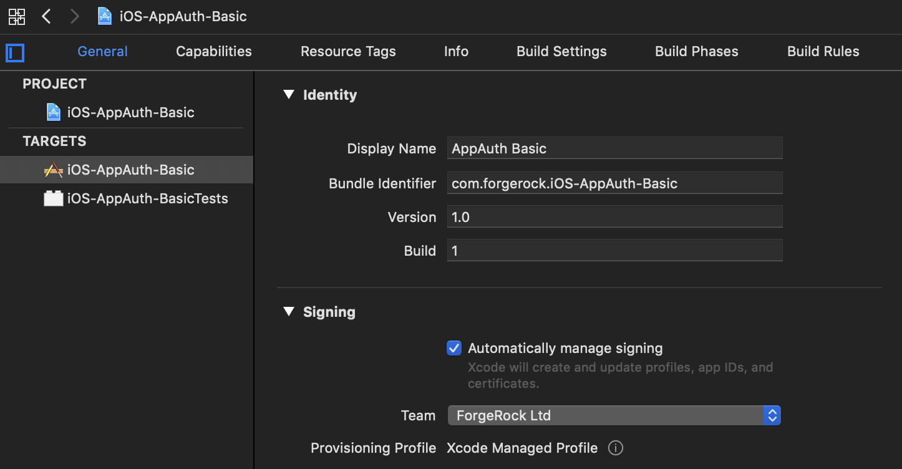
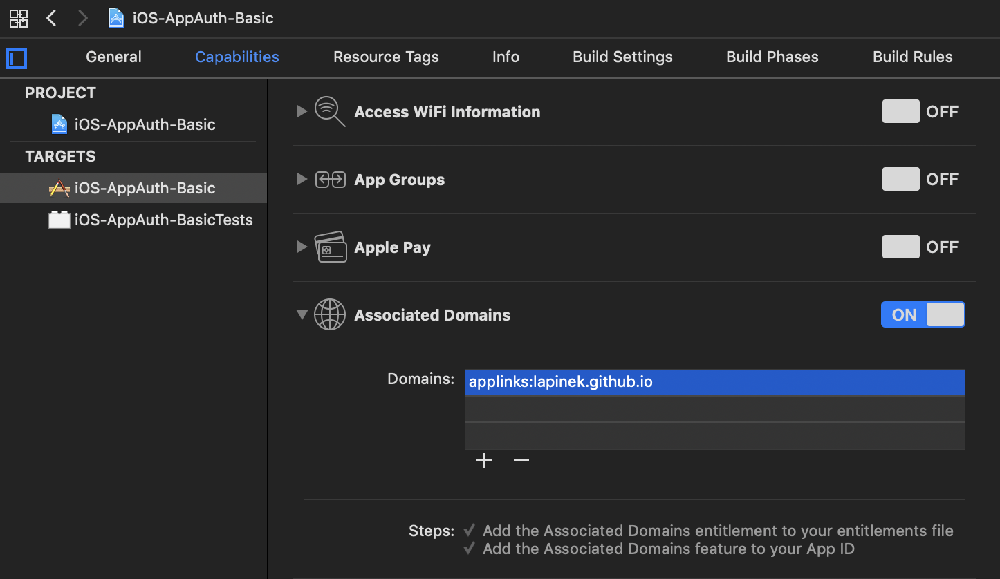
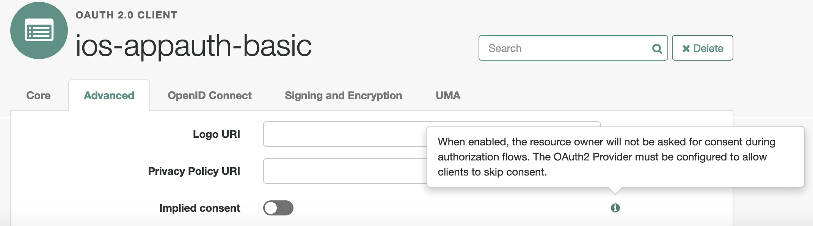
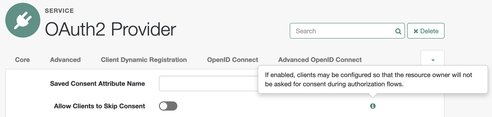

# <a id="top"></a>Implementing OAuth 2.0 Authorization Code Grant protected by PKCE with the AppAuth SDK for iOS

## Contents

* [Preface](#preface)
* [Introduction](#intro)
* [Building a simple app with Swift and AppAuth](#simple) (the code is here)
* [ForgeRock example](#full)
* [Conclusion](#conclusion)

## <a id="preface"></a> Preface

[Back to top](#top)

In this document, we will leverage terminology defined in [OAuth 2.0](https://tools.ietf.org/html/rfc6749) and one of its extensions—[OpenID Connect](https://openid.net/specs/openid-connect-core-1_0.html). We will also take into consideration the best current practices for building native OAuth 2.0 clients—that is, applications running on the end-user's (mobile) device.

## <a id="intro"></a> Introduction

[Back to top](#top)

Recommendations for OAuth 2.0 implementation in Native Apps are summarized in [RFC 8252](https://tools.ietf.org/html/rfc8252) and provide following key points:

1. OAuth 2.0 authorization requests from native apps should only be made through external user-agents (as opposed to embedded user-agents, like a built-in or a custom web view); typically, the system browser or its programmatic instantiation called the "in-app browser tab".

    Employing an external user-agent keeps the end-user credentials away from the native client. The browser's URL address bar may also serve as a security device, providing the end-user with an option to make an informed decision before falling victim to a phishing attack.

    The in-app browser tab implementation allows for accessing the browser's authentication state and security context without leaving the native app. The following classes implement the in-app browser tab functionality in iOS:

    * [ASWebAuthenticationSession](https://developer.apple.com/documentation/authenticationservices/aswebauthenticationsession) (iOS 12.0+)
    * [SFAuthenticationSession](https://developer.apple.com/documentation/safariservices/sfauthenticationsession) (iOS 11.0–12.0 Deprecated)
    * [SFSafariViewController](https://developer.apple.com/documentation/safariservices/sfsafariviewcontroller) (iOS 9.0+)

    Using a native browser or an in-app browser tab in iOS _may_ provide access to existing session information, thus allowing for single sign-on (SSO) experience.

    > The authentication classes, `ASWebAuthenticationSession` and `SFAuthenticationSession`, utilized by AppAuth in iOS 11 and 12, do not share session (that is, transient) cookies with their other instances or with mobile Safari. The authentication cookies need to be persistent in order to implement SSO with the classes in a way that is compliant with RFC 8252.
    >
    > We continue discussion on this subject in [Enabling SSO for the AppAuth SDK in iOS](SSO/README.md).

    A web view allows access to its data, including cookies, user credentials, and so on, from the hosting app. Due to its unsafe nature, use of a web view for authorization and authentication purposes could be prohibited by identity providers ([example 1](https://developers.googleblog.com/2016/08/modernizing-oauth-interactions-in-native-apps.html) and [example 2](https://dev.fitbit.com/build/reference/web-api/oauth2/#obtaining-consent)). A web view is NOT a recommended way to implement authorization flows, especially in the context of a third-party application that cannot be trusted by the end-user.

0. The authorization request should be made with the Authorization Code grant.

    In most cases, native apps cannot maintain the confidentiality of a client secret, making them [OAuth 2.0 public clients](https://tools.ietf.org/html/rfc6749#section-2.1), for the (statically included) secret would be shared between instances of an app and available for retrieval. Public clients have two types of grants available to implement: [Authorization Code](https://tools.ietf.org/html/rfc6749#section-1.3.1) and [Implicit](https://tools.ietf.org/html/rfc6749#section-1.3.2).

    The [OAuth 2.0 Security Best Current Practice](https://tools.ietf.org/id/draft-ietf-oauth-security-topics-12.html#implicit-grant) puts limits on use of the Implicit grant and recommends the Authorization Code grant as the more secure and more functional option.

    An OAuth 2.0 native client needs to be able to serve the redirection URI. If an app is using a [private-use (custom) URI scheme redirection](https://tools.ietf.org/html/rfc8252#section-7.1), the same scheme could be registered by another app on the same device. If the private-use scheme is handled on the system level, the authorization response can be intercepted by the other, potentially malicious, app. The authorization code grant allows for mitigating interception attacks with the [Proof Key for Code Exchange](https://tools.ietf.org/html/rfc7636) (PKCE) technique, which is not applicable in its current implementation to the Implicit grant.

    > If one of the authentication classes (`ASWebAuthenticationSession` or `SFAuthenticationSession`) is initialized with the [callbackURLScheme](https://developer.apple.com/documentation/authenticationservices/aswebauthenticationsession/2990952-init) argument populated with a private-use URI Scheme, the redirection URI can be delivered directly to the app.

    If a [claimed "https" scheme URI](https://tools.ietf.org/html/rfc8252#section-7.2) is used (a [Universal Link](https://developer.apple.com/ios/universal-links/), in Apple terms), only the app associated with this URI can receive it. Even then, RFC 8252 recommends PKCE for protecting the authorization code exchange process, which, in the case of native clients, does not require client authentication.

    > The [OAuth 2.0 Threat Model and Security Considerations](https://tools.ietf.org/html/rfc6819) (RFC 6819) describes ways the authorization code could end up in the hands of a malicious party. The OAuth 2.0 security best current practice document extends this model and simply obligates all OAuth 2.0 clients to [use PKCE in every Authorization Code grant](https://tools.ietf.org/id/draft-ietf-oauth-security-topics-12.html#ac).

    In addition to improved security, the Authorization Code grant allows for re-obtaining access tokens with refresh tokens—that is, without user interaction, which is important for a native app user experience.

0. In order to prevent [Client Impersonation](https://tools.ietf.org/html/rfc8252#section-8.6), the authorization server should not process authorization requests for a public client automatically, without user consent or interaction, unless the identity of the client can be proven.

    Using PKCE by itself does not cover a peculiar case of a malicious client performing the Authorization Code grant with its own `code_challenge` and `code_verifier` on behalf of another client, using the latter's publicly available client ID and redirection URI.

    To eliminate this possibility, a [claimed "https" scheme](https://tools.ietf.org/html/rfc8252#section-7.2) SHOULD be used in the redirection URI, which will uniquely identify the client, preventing any other client from receiving responses from the authorization server. Since the app and the URI association is hosted on a website, no foreign app can claim this URI. If the claimed URI cannot be directed to the legitimate client app, the external user agent will handle it—but not a different client.

    Another way to identify the client software is to _always_ present the end-user with a consent screen where the client identifier is displayed (along with other information that may help to make a conscious decision) by the authorization server. For example, the authorization server may ask the user to authorize the client for accessing certain predefined [scopes](https://tools.ietf.org/html/rfc6749#section-3.3) associated with the client's account. The consent screen method, in its best implementation, will still depend on the end-user's attentiveness and discernment. Some limitations of this approach are set out in [Section 5.5 of RFC 8619](https://tools.ietf.org/html/rfc6819#section-5.5).

    > In iOS 11 and 12, the authentication classes, `ASWebAuthenticationSession` and `SFAuthenticationSession`, will _automatically_ present a mandatory dialog box asking the end-user to give explicit consent for accessing the website’s data (and the existing login information) in Safari every time the authorization endpoint is visited. This consent screen displays the app’s (product) name and, seemingly, the endpoint domain name, if the latter is a recognizable [top-level domain](https://en.wikipedia.org/wiki/List_of_Internet_top-level_domains). It doesn't, however, tell the end-user anything about the OAuth 2.0 client to be authorized. In iOS 13, the dialog _may_ be omitted by configuring `ASWebAuthenticationSession` for a private session via the [prefersEphemeralWebBrowserSession](https://developer.apple.com/documentation/authenticationservices/aswebauthenticationsession/3237231-prefersephemeralwebbrowsersessio) parameter. However, sharing browser data and SSO will not be an option in this case.
    >
    > `SFSafariViewController` can be used in iOS 9.0 and above, and does not ask for user consent. It shares cookies and other website data with its instances in iOS 9 and 10, thus allowing for easy client impersonation in those environments—if no consent screen is displayed by the authorization server. The same, except being version independent, applies to mobile Safari, the default browser in iOS.

    The particularities of the iOS environment, combined with the fact that some identity providers allow for saving the user's consent and not asking for it again, mean that a consistent implementation of a mandatory consent screen may prove infeasible.

    Consequently, Universal Links are currently the only reliable and generic way of confirming the client identity in iOS. Unfortunately, Universal Links are not very well suited for OAuth 2.0 redirection flows at the moment. At present, they do not appear to work with HTTP redirects in iOS 9 and [seem to require an intermediate screen in front of the authorization endpoint](https://openradar.appspot.com/51091611) in iOS 10-12. The authorization server consent dialog may serve the role of such screen, making it a mandatory addition to the technique in the contemporary iOS environment. Combined with use of refresh tokens, this may constitute an acceptable end-user experience, although, for mobile applications developed by the same business entity as the one they are authorized by and consume resources from, the "first-party" clients, any consent screen may seem redundant and distracting.

The included example iOS applications play the role of an [OpenID Connect](https://openid.net/connect/) (OIDC) [Relying Party](https://openid.net/specs/openid-connect-core-1_0.html#Terminology) (RP) and use the [AppAuth-iOS SDK](https://github.com/openid/AppAuth-iOS) for authorizing the RP against an [OIDC Provider](https://openid.net/specs/openid-connect-core-1_0.html#Terminology) (OP). The AppAuth SDK follows the best practices described in RFC 8252 by extending the OAuth 2.0 protocol with PKCE and employing an external user agent for visiting the OP's authentication and authorization endpoints. An access token obtained during the authorization process is then included as the [Bearer Token](https://tools.ietf.org/html/rfc6750) value of the `Authorization` header in requests made to protected endpoints on a [Resource Server](https://tools.ietf.org/html/rfc6749#section-1.1) (RS).

***

## <a id="simple"></a>Building a simple app with Swift and AppAuth

[Back to top](#top)

The purpose of this exercise is to build from scratch (step-by-step, each of which will be commented on) the most basic app capable of performing HTTP requests to a resource protected with OAuth 2.0. Xcode 10 and Swift 4 environment and iOS 9-12 targets will be assumed. The AppAuth SDK for iOS will be employed to perform the authorization flow.

All URIs and the private-use URI scheme used below serve demonstrational purposes. Feel free to replace them with your own OP and RP specifics.

The completed Xcode project can be found at [https://github.com/ForgeRock/exampleOAuth2Clients/tree/master/iOS-AppAuth/iOS-AppAuth-Basic](https://github.com/ForgeRock/exampleOAuth2Clients/tree/master/iOS-AppAuth/iOS-AppAuth-Basic) and could be used as a quick reference. A [short video](https://forgerock.wistia.com/medias/r7yn6bpfle) demonstrates the final result.

We will build the app in a few implementation steps:

* [Enabling TLS in development environment](#simple-https)
* [Collecting information about the OP](#simple-op)
* [Collecting information about the RP](#simple-rp)
* [Setting up Xcode project and adding the AppAuth SDK](#simple-xcode)
* [Copy 'n' Paste](#simple-app) (the actual code is here)
* [In fine](#simple-conclusion)

0. <a id="simple-https"></a>Enabling TLS in development environment

    [Back to Building a simple app with Swift and AppAuth](#simple)

    If your OAuth 2.0 development servers (the OP and the RS) require HTTPS and use self-signed certificates, you will need to accommodate that with an approach described in [Apple's Technical Q&A: HTTPS and Test Servers](https://developer.apple.com/library/archive/qa/qa1948/_index.html).

    To install a CA root certificate on an iOS device simulator, for example, drag and drop the certificate file on a (preferably Settings) screen and follow the installation prompt. If there is no installation prompt, you may need to manually open Settings > General > Profile > _your-CA-certificate_ to install the certificate after it has been downloaded. On a more recent version of iOS, enable the certificate in General > About > Certificate Trust Settings. It may take more than one attempt to engage the installation process. In that case, don't get discouraged and keep trying; eventually, the simulator will cooperate.

    A [short video](https://forgerock.wistia.com/medias/1wft6023jm) shows the installation flow on an iOS 12.1 simulator.

    > On the latest iOS simulator, 12.2 at the time of writing this note, you may need to manually open `Settings` > `General` > `Profile` > _`your-CA-certificate`_ to install the certificate after it has been downloaded. You will still need to enable it in `General` > `About` > `Certificate Trust Settings`.

0. <a id="simple-op"></a>Collecting information about the OP

    [Back to Building a simple app with Swift and AppAuth](#simple)

    The AppAuth SDK for iOS provides an option to specify location of the [OpenID Provider Configuration Document](https://openid.net/specs/openid-connect-discovery-1_0.html#ProviderConfig) if it is supported by the OP. In this case, all endpoints necessary for the authorization flow could be obtained automatically by the SDK from the well-known location.

    > You can read more about OIDC discovery configuration and see a sample of the data returned from the well-known endpoint in [ForgeRock Access Management](https://www.forgerock.com/platform/access-management) (AM) [documentation](https://backstage.forgerock.com/docs/am/6/oidc1-guide/#configure-openid-connect-discovery). If you have an AM instance running you will be able to see a live version of the configuration document at `https://your-am-instance/oauth2/.well-known/openid-configuration`.

    Alternatively, the OP's endpoints that will be used in the authorization process can be provided manually. In this case, you will need values for the following items described in the [OpenID Provider Metadata](https://openid.net/specs/openid-connect-discovery-1_0.html#ProviderMetadata) specification:

    * _issuer_
    * _authorization_endpoint_
    * _token_endpoint_
    * (optional) _userinfo_endpoint_
    * (optional) _end_session_endpoint_

0. <a id="simple-rp"></a>Collecting information about the RP

    [Back to Building a simple app with Swift and AppAuth](#simple)

    You will need following details about the RP (that is, the client) registration with the OP, as described in the [The OAuth 2.0 Authorization Framework](https://tools.ietf.org/html/rfc6749) spec:

    * _client_id_
    * _redirect_uri_
    * _scope_: the scopes available for this client (to choose from when sending the authorization request)

    In this example, the application code will only request `openid` and `profile` scopes.

    Means to obtain the RP registration details are specific to the OP and not covered here. For example, you can consult the [Registering OAuth 2.0 Clients With the Authorization Service](https://backstage.forgerock.com/docs/am/6/oauth2-guide/#register-oauth2-client) guide on creating and obtaining client credentials and scopes for an RP registered with ForgeRock Access Management.

    > You could also refer to the [ForgeRock example](#full) section, where the process of registering a client is described in the context of a running ForgeRock platform instance.
    >
    > For example, if your OP is [ForgeRock Access Management](https://www.forgerock.com/platform/access-management) (AM), the cURL command for client registration may look like this:
    >
    > ```bash
    > curl -k 'https://default.iam.example.com/am/json/realms/root/realm-config/agents/OAuth2Client/ios-appauth-basic' \
    > -X PUT \
    > --data '{
    >     "clientType": "Public",
    >     "redirectionUris": ["com.forgeops.ios-appauth-basic:/oauth2/forgeops/redirect", "https://lapinek.github.io/oauth2redirect/ios-appauth-basic"],
    >     "scopes": [
    >         "openid",
    >         "profile"
    >     ],
    >     "tokenEndpointAuthMethod": "client_secret_post",
    >     "isConsentImplied": true,
    >     "postLogoutRedirectUri": ["com.forgeops.ios-appauth-basic:/oauth2/forgeops/redirect", "https://lapinek.github.io/oauth2redirect/ios-appauth-basic"],
    >     "grantTypes": [
    >         "authorization_code"
    >     ]
    > }' \
    > -H 'Content-Type: application/json' \
    > -H 'Accept: application/json' \
    > -H 'Cookie: iPlanetDirectoryPro='$( \
    >     curl -k -s https://default.iam.example.com/am/json/realms/root/authenticate \
    >     -X POST \
    >     -H 'X-OpenAm-Username:amadmin' \
    >     -H 'X-OpenAm-Password:password' \
    >     | sed -e 's/^.*"tokenId":"\([^"]*\)".*$/\1/' \
    > )
    > ```

    To start with, we will use a private-use URI scheme for the redirection URI: `com.forgeops.ios-appauth-basic:/oauth2/forgeops/redirect`.

    > The AppAuth SDK for iOS supports Universal Links, and an example of their implementation will be introduced later in the [Copy 'n' Paste](#simple-app) section. However, as a general technique, Universal Links are not universally adopted by the OAuth 2.0 community, which applies to some Identity Providers ([example](https://developers.google.com/identity/protocols/OAuth2InstalledApp)). Hence, a case based on a custom URL scheme redirection will be described first.

    Note, that the full and exact redirection URI MUST be registered for the RP with the OP.

0. <a id="simple-xcode"></a>Setting up [Xcode](https://developer.apple.com/xcode/) project and adding the AppAuth SDK

    [Back to Building a simple app with Swift and AppAuth](#simple)

    For the purposes of this example, we will assume Xcode 10 environment, Swift 4.2, and the sample application built down to iOS 9.0 to demonstrate some important differences in versions below iOS 11.

    > According to unofficial market share stats, less than one percent of all devices are using iOS below version 9.

    Follow the steps below:

    1. Creating the project

        Create a new Single View App Xcode project for iOS choosing Swift as the language:

        File > New > Project... > Single View App

        Follow the prompts and provide Product Name and Organization details. Save the new project in a location of choice.

        If desired, provide a Display Name that will appear on the iOS device.

    0. Installing the dependency manager

        Install [Carthage](https://github.com/Carthage/Carthage).

        We will add the AppAuth framework to the project with Carthage. This unobtrusive dependency manager makes no changes to the Xcode project, making it easy to maintain.

        > You can also add the SDK as a static library or with [CocoaPods](https://guides.cocoapods.org/using/getting-started.html), as described in the [AppAuth for iOS documentation](https://github.com/openid/AppAuth-iOS#setup).

    0. Setting AppAuth as a project dependency

        Navigate to the project root (that is, where `your-project-name.xcodeproj` is located) and create a `Cartfile` file; add the following line:

        _github "openid/AppAuth-iOS" "master"_

        For example:

        ```bash
        echo 'github "openid/AppAuth-iOS" "master"' > Cartfile
        ```

        In the project root, run:

        ```bash
        carthage bootstrap --platform ios
        ```

        > After the initial bootstrap, if you expect updates in the library, you can also try to update its content with the latest:
        >
        > ```bash
        > carthage update --platform iOS
        > ```

        This will build the AppAuth framework for iOS in your project under the Carthage directory, according to the dependency specified in `Cartfile` and the provided `--platform` option. Providing no platform option will result in building frameworks for all supported platforms, which won't hurt but may prove unnecessary.

        > The artifacts created by Carthage (namely `Carthage/Build` and `Carthage/Checkouts`) may be optionally committed to version control. This is advisable if the dependencies are not recreated (and possibly updated) in the project's other instances.

    0. Setting up the AppAuth framework

        In the Xcode project Navigator select the project and then the target under TARGETS. Under the General tab, scroll down to Linked Frameworks and Libraries and add the AppAuth framework:

        Select +, and then Add Other..., navigate to _your-project-root_ > Carthage > Build > iOS, and select AppAuth.framework; then, select Open.

        

        Next, switch over to the target's Build Phases tab and add a new Run Script build phase:

        Select +, choose New Run Script Phase, expand the newly created Run Script entry, and add the following shell command _under_ Shell (do not change the Shell path):

        ```bash
        /usr/local/bin/carthage copy-frameworks
        ```

        Under Input Files, select + and add:

        ```bash
        $(SRCROOT)/Carthage/Build/iOS/AppAuth.framework
        ```

        

        > At any point of building the app, including this very point, you can change the iOS deployment target under Building Settings.

0. <a id="simple-app"></a>Copy 'n' Paste

    [Back to Building a simple app with Swift and AppAuth](#simple)

    Organizing the code for this app will consist of several distinct steps; after each step you should be able to build and run the app. Copy-and-paste is all you need to do to get started, but along the way we will also explain what the steps do:

    * [Handling OAuth 2.0 redirection](#simple-app-redirection)
    * [Making AppAuth available in the main controller](#simple-app-appauth)
    * [Providing OP configuration to the authorization services](#simple-app-op)
    * [Providing RP configuration to the authorization services](#simple-app-rp)
    * [Making authorization request](#simple-app-request)
    * [Maintaining authorization state](#simple-app-state)
    * [Authorizing the RP](#simple-app-auth)
    * [Making API requests](#simple-app-api)
    * [Decoding ID Token](#simple-app-id)
    * [Universal Links](#simple-app-universal-links)
    * [Optional](#simple-app-ui)
    * [Completely Optional](#simple-app-ui-extra)

    1. <a id="simple-app-redirection"></a>Handling OAuth 2.0 redirection

        [Back to Copy 'n' Paste](#simple-app)

        In iOS 11-12 environment, AppAuth employs designated authentication classes serving as the "in-app browser tabs" for making authorization requests:

        * [ASWebAuthenticationSession](https://developer.apple.com/documentation/authenticationservices/aswebauthenticationsession) (iOS 12.0+)
        * [SFAuthenticationSession](https://developer.apple.com/documentation/safariservices/sfauthenticationsession) (iOS 11.0–12.0 Deprecated)

        In the current AppAuth implementation, these classes are initialized with the [callbackURLScheme](https://developer.apple.com/documentation/authenticationservices/aswebauthenticationsession/2990952-init) argument, which allows the app to receive the redirection URI the authorization request was made with.

        In iOS 9-10, however, [SFSafariViewController](https://developer.apple.com/documentation/safariservices/sfsafariviewcontroller) is used to perform the authorization request. This view controller does not provide an option to be initialized with a private-use callback scheme; hence, one needs to be added to be the project's `Info.plist` in order for the app to be able to respond to the redirection URI.

        > The same applies to iOS versions below 9, which use mobile Safari as the external user agent.

        To specify the redirection URI scheme in `Info.plist`:

        * Add URL types key to Information Property List (the corresponding "raw" value is CFBundleURLTypes; right-click the key list, and select Show Raw Keys/Values to have it shown).
        * Fully expand the key and populate it with a URL Schemes (`CFBundleURLSchemes`) item.
        * Add to `URL Schemes` an item of the type `String` with the scheme of your redirection URI. The scheme is everything before the colon (`:`). For example, if the redirect URI is `com.forgeops.ios-appauth-basic:/oauth2/forgeops/redirect`, then the scheme would be `com.forgeops.ios-appauth-basic`.

        

        > The official documentation provides more details on [Defining a Custom URL Scheme for Your App](https://developer.apple.com/documentation/uikit/core_app/allowing_apps_and_websites_to_link_to_your_content/defining_a_custom_url_scheme_for_your_app).

        With the URL scheme registered, the redirection URI can be delivered to the app. This will bring the app to the foreground and call the AppDelegate's [application(_:open:options:)](https://developer.apple.com/documentation/uikit/uiapplicationdelegate/1623112-application) method. (AppAuth will automatically close the external user agent instance.)

        > Please see the conditions for invoking this AppDelegate's method in its documentation referenced above.

        In `application(_:open:options:)` the incoming URL can be parsed, and an AppAuth handler for the authorization response can be provided. We will need to import the AppAuth SDK first; at the top of `AppDelegate.swift` add:

        ```swift
        // AppDelegate.swift

        // MARK: Importing the AppAuth SDK
        import AppAuth
        ```

        Then, provide the following declarations to the AppDelegate class that will create a placeholder for the authorization session and refer to it during the redirection:

        ```swift
        // AppDelegate.swift

        class AppDelegate: UIResponder, UIApplicationDelegate {

            // . . .

            /**
            An AppAuth property to hold the session, in order to continue the authorization flow from the redirection.
            */
            var currentAuthorizationFlow: OIDExternalUserAgentSession?

            func application(_ app: UIApplication, open url: URL, options: [UIApplication.OpenURLOptionsKey: Any] = [:]) -> Bool {
                /*
                Sending the redirection URL to the existing AppAuth flow, if any, for handling the authorization response.
                */
                if let authorizationFlow = self.currentAuthorizationFlow, authorizationFlow.resumeExternalUserAgentFlow(with: url) {
                    self.currentAuthorizationFlow = nil

                    return true
                }

                return false
            }

            // . . .
        ```

        Don't worry about lack of indentation in the comments; when pasted in Xcode they will be aligned according to the convention in place.

    0. <a id="simple-app-appauth"></a>Making AppAuth available in the main controller

        [Back to Copy 'n' Paste](#simple-app)

        In order to make AppAuth functionality available in the main view controller, at the top of (automatically created) `ViewController.swift`, import the AppAuth SDK:

        ```swift
        // ViewController.swift

        // MARK: Importing the AppAuth SDK
        import AppAuth
        ```

    0. <a id="simple-app-op"></a>Providing OP configuration to the authorization services

        [Back to Copy 'n' Paste](#simple-app)

        Ultimately, the AppAuth library performs client authorization via an `OIDAuthorizationRequest` instance initiated with the following parameters:

        * _configuration_: AppAuth's `OIDServiceConfiguration` instance
        * _clientId_: the RP's client ID as it's been registered on the OP's authorization server
        * _clientSecret_ (optional): may be populated for dynamically registered clients
        * _scopes_: the (subset of) scopes provided in the RP registration
        * _redirectURL_: a redirection URI associated with the RP registration
        * _additionalParameters_ (optional): whatever else that may be handled at the [OAuth 2.0 Authorization Endpoint](https://tools.ietf.org/html/rfc6749#section-3.1)

        ### Option 1

        The configuration parameter contains the OP's endpoint information and can be set manually. To have that option, add the following extension to the main view controller (outside of the class definition):

        ```swift
        // ViewController.swift

        // . . .

        // MARK: OIDC Provider configuration
        extension ViewController {
            /**
            Returns OIDC Provider configuration.

            In this method the endpoints are provided manually.
            */
            func getOIDCProviderConfiguration() -> OIDServiceConfiguration {
                let configuration = OIDServiceConfiguration.init(
                    authorizationEndpoint: URL(string: "https://default.iam.example.com/am/oauth2/authorize")!,
                    tokenEndpoint: URL(string: "https://default.iam.example.com/am/oauth2/access_token")!
                )

                return configuration
            }
        }
        ```

        The `authorizationEndpoint` and `tokenEndpoint` URLs are necessary for authorizing an existing client. To enable additional interactions with the OP, such as dynamic client registration, RP initiate logout, and so on, other endpoints may need to be provided.

        ### Option 2

        Alternatively, if the OP supports issuer discovery, the configuration object may be populated automatically from the issuer's `/.well-known/openid-configuration` endpoint, as described in the [OpenID Connect Discovery specs](https://openid.net/specs/openid-connect-discovery-1_0.html#ProviderConfig). Doing so has the advantage of dynamically accessing the OP's current endpoint information. This, however, is done by making an HTTP request; hence, obtaining the configuration becomes a slower asynchronous task which requires a completion handler. To have this as an option, add the following method to the extension you just created:

        ```swift
        // ViewController.swift

        // . . .

        // MARK: OIDC Provider configuration
        extension ViewController {
            // . . .

            /**
            Returns OIDC Provider configuration.

            In this method the OP's endpoints are retrieved from the issuer's well-known OIDC configuration document location (asynchronously). The response is handled then with the passed in escaping callback.
            */
            func discoverOIDServiceConfiguration(_ issuerUrl: String, completion: @escaping (OIDServiceConfiguration?, Error?) -> Void) {
                // Checking if the issuer's URL can be constructed.
                guard let issuer = URL(string: issuerUrl) else {
                    print("Error creating issuer URL for: \(issuerUrl)")

                    return
                }

                print("Retrieving configuration for: \(issuer.absoluteURL)")

                // Discovering endpoints with AppAuth's convenience method.
                OIDAuthorizationService.discoverConfiguration(forIssuer: issuer) {
                    configuration, error in

                    // Completing with the caller's callback.
                    completion(configuration, error)
                }
            }
        }
        ```

        Implementing both methods may be desirable for accommodating different OIDC Providers.

    0. <a id="simple-app-rp"></a>Providing RP configuration to the authorization services

        [Back to Copy 'n' Paste](#simple-app)

        Whichever way the issuer configuration is obtained, to initiate an `OIDAuthorizationRequest` instance, you will need to provide `clientId`, `scopes`, and `redirectURL` parameters. Add following definitions to the main _class_:

        ```swift
        // ViewController.swift

        class ViewController: UIViewController {
            /**
            OAuth 2 client ID.

            Dynamic client registration is not demonstrated in this example.
            */
            let clientId = "ios-appauth-basic"

            /**
            Scheme used in the redirection URI.

            This value is provided separately so that its presence in `Info.plist` can be easily checked and so that it can be reused with different redirection URIs.
            */
            let redirectionUriScheme = "com.forgeops.ios-appauth-basic"

            /**
            OAuth 2 redirection URI for the client.

            The redirection URI is provided as a computed property, so that it can refer to the class' instance properties.
            */
            var redirectionUri: String {
                return redirectionUriScheme + ":/oauth2/forgeops/redirect"
            }

            // . . .
        ```

        It seems reasonable to assume that an app represents a single OAuth 2.0 Client or OIDC Relying Party. The OP and RP properties can also be made available as global variables or in other ways.

    0. <a id="simple-app-request"></a>Making authorization request

        [Back to Copy 'n' Paste](#simple-app)

        The AppAuth SDK allows for obtaining an authorization code and exchanging it for a token with a single call to an `OIDAuthState` convenience method. We will take this approach by adding the following extension to the main class:

         ```swift
        // ViewController.swift

        // . . .

        // MARK: Authorization methods
        extension ViewController {
            /**
            Performs the authorization code flow.

            Attempts to perform a request to authorization endpoint by utilizing AppAuth's convenience method.
            Completes authorization code flow with automatic code exchange.
            The response is then passed to the completion handler, which lets the caller to handle the results.
            */
            func authorizeWithAutoCodeExchange(
                configuration: OIDServiceConfiguration,
                clientId: String,
                redirectionUri: String,
                scopes: [String] = [OIDScopeOpenID, OIDScopeProfile],
                completion: @escaping (OIDAuthState?, Error?) -> Void
                ) {
                // Checking if the redirection URL can be constructed.
                guard let redirectURI = URL(string: redirectionUri) else {
                    print("Error creating redirection URL for : \(redirectionUri)")

                    return
                }

                // Checking if the AppDelegate property holding the authorization session could be accessed
                guard let appDelegate = UIApplication.shared.delegate as? AppDelegate else {
                    print("Error accessing AppDelegate")

                    return
                }

                // Building authorization request.
                let request = OIDAuthorizationRequest(
                    configuration: configuration,
                    clientId: clientId,
                    clientSecret: nil,
                    scopes: scopes,
                    redirectURL: redirectURI,
                    responseType: OIDResponseTypeCode,
                    additionalParameters: nil
                )

                // Making authorization request.

                print("Initiating authorization request with scopes: \(request.scope ?? "no scope requested")")

                appDelegate.currentAuthorizationFlow = OIDAuthState.authState(byPresenting: request, presenting: self) {
                    authState, error in

                    completion(authState, error)
                }
            }
        }
        ```

        Potentially, an app may be authorized with multiple providers; hence, it may be beneficial to allow the caller of the authorization method to handle the authorization response (differently for different OPs) via the completion handler.

        Handling authorization and token requests separately could be needed in certain scenarios, if any custom processing or interaction is required between the two events. In these cases, the authorization code flow could be interrupted by utilizing AppAuth's `OIDAuthorizationService` methods. To illustrate, if `OIDAuthorizationService` was used in the authorization method that we added to the main class, the code could look like this:

        ```swift
        /**
        Makes token exchange request.

        The code obtained from the authorization request is exchanged at the token endpoint.
        */
        func makeTokenRequest(completion: @escaping (OIDAuthState?, Error?) -> Void) {
            guard let tokenExchangeRequest = self.authState?.lastAuthorizationResponse.tokenExchangeRequest() else {
                print("Error creating access token request.")

                return
            }

            print("Making token request with: ", tokenExchangeRequest)

            OIDAuthorizationService.perform(tokenExchangeRequest) {
                response, error in

                if let response = response {
                    print("Received token response with access token: ", response.accessToken ?? "")
                } else {
                    print("Error making token request: \(error?.localizedDescription ?? "")")
                }

                self.authState?.update(with: response, error: error)

                completion(self.authState, error)
            }
        }

        /**
        Performs the authorization code flow in two steps.

        Attempts to perform a request to authorization endpoint by utilizing an OIDAuthorizationService method.
        Completes authorization code flow with code exchange initiated manually by invoking a separate OIDAuthorizationService method.
        The response is then passed to the completion handler, which lets the caller to handle the results.

        This method is not used and is here for illustration purposes.
        */
        func authorizeWithManualCodeExchange(
            configuration: OIDServiceConfiguration,
            clientId: String,
            redirectionUri: String,
            scopes: [String] = [OIDScopeOpenID, OIDScopeProfile],
            completion: @escaping (OIDAuthState?, Error?) -> Void
            ) {
            // Checking if the redirection URL can be constructed.
            guard let redirectURI = URL(string: redirectionUri) else {
                print("Error creating redirection URL for : \(redirectionUri)")

                return
            }

            // Checking if the AppDelegate property holding the authorization session could be accessed.
            guard let appDelegate = UIApplication.shared.delegate as? AppDelegate else {
                print("Error accessing AppDelegate")

                return
            }

            // Building authorization request.
            let request = OIDAuthorizationRequest(
                configuration: configuration,
                clientId: clientId,
                clientSecret: nil,
                scopes: scopes,
                redirectURL: redirectURI,
                responseType: OIDResponseTypeCode,
                additionalParameters: nil
            )

            // Making authorization request.
            appDelegate.currentAuthorizationFlow = OIDAuthorizationService.present(request, presenting: self) {
                response, error in

                if let response = response {
                    print("Received authorization response with code: \(response.authorizationCode ?? "")")

                    let authState = OIDAuthState(authorizationResponse: response)

                    self.setAuthState(authState)

                    // Custom processing here.

                    self.makeTokenRequest() {
                        authState, error in

                        completion(authState, error)
                    }
                } else {
                    print("Error making authorization request: \(error?.localizedDescription ?? "")")

                    completion(nil, error)
                }
            }
        }
        ```

        In this walk through, we will assume the method with automatic code exchange is used.

    0. <a id="simple-app-state"></a>Maintaining authorization state

        [Back to Copy 'n' Paste](#simple-app)

        We can now make an authorization request, but we are not quite ready to handle it. If authorization is successful, an authorization state object becomes available and needs to be maintained.

        From AppAuth documentation:

        > OIDAuthState is a class that keeps track of the authorization and token requests and responses, and provides a convenience method to call an API with fresh tokens. This is the only object that you need to serialize to retain the authorization state of the session.

        In this example, we will cover a single OP scenario and maintain only one authorization state instance. In the main class definition, add a property to hold a single authorization state:

        ```swift
        // ViewController.swift

        class ViewController: UIViewController {
            // . . .

            /**
            Class property to store the authorization state.
            */
            private var authState: OIDAuthState?

            // . . .
        ```

        The authorization state (that may contain token information) will be updated with responses received from the authorization server and cleared out on errors. It can be changed in the app code and also internally in the AppAuth SDK. The authorization state can also be serialized and saved in a user specific storage, being preserved between app launches. Then, every time the state changes, the persistent storage will need to be updated.

        First, we will add another property to the main class to specify the key under which the authorization state will be stored:

        ```swift
        // ViewController.swift

        class ViewController: UIViewController {
            // . . .

            /**
            The key under which the authorization state will be saved in a keyed archive.
            */
            let authStateKey = "authState"

            // . . .
        }
        ```

        Then, we will provide a set of methods for setting, saving, and loading the authorization state and group them under another extension for the main class:

        ```swift
        // ViewController.swift

        // . . .

        // MARK: OIDAuthState methods
        extension ViewController {
            /**
            Saves authorization state in a storage.

            As an example, the user's defaults database serves as the persistent storage.
            */
            func saveState() {
                var data: Data? = nil

                if let authState = self.authState {
                    if #available(iOS 12.0, *) {
                        data = try! NSKeyedArchiver.archivedData(withRootObject: authState, requiringSecureCoding: false)
                    } else {
                        data = NSKeyedArchiver.archivedData(withRootObject: authState)
                    }
                }

                UserDefaults.standard.set(data, forKey: authStateKey)
                UserDefaults.standard.synchronize()

                print("Authorization state has been saved.")
            }

            /**
            Reacts on authorization state changes events.
            */
            func stateChanged() {
                self.saveState()
            }

            /**
            Assigns the passed in authorization state to the class property.
            Assigns this controller to the state delegate property.
            */
            func setAuthState(_ authState: OIDAuthState?) {
                if (self.authState != authState) {
                    self.authState = authState

                    self.authState?.stateChangeDelegate = self

                    self.stateChanged()
                }
            }

            /**
            Loads authorization state from a storage.

            As an example, the user's defaults database serves as the persistent storage.
            */
            func loadState() {
                guard let data = UserDefaults.standard.object(forKey: authStateKey) as? Data else {
                    return
                }

                var authState: OIDAuthState? = nil

                if #available(iOS 12.0, *) {
                    authState = try! NSKeyedUnarchiver.unarchiveTopLevelObjectWithData(data) as? OIDAuthState
                } else {
                    authState = NSKeyedUnarchiver.unarchiveObject(with: data) as? OIDAuthState
                }

                if let authState = authState {
                    print("Authorization state has been loaded.")

                    self.setAuthState(authState)
                }
            }

            /**
            Displays selected information from the current authorization data.
            */
            func showState() {
                print("Current authorization state: ")

                print("Access token: \(authState?.lastTokenResponse?.accessToken ?? "none")")

                print("ID token: \(authState?.lastTokenResponse?.idToken ?? "none")")

                print("Expiration date: \(String(describing: authState?.lastTokenResponse?.accessTokenExpirationDate))")
            }
        }
        ```

        Initially, `self.authState?.stateChangeDelegate = self` line will produce an error in Xcode, because we didn't conform to the `stateChangeDelegate` property protocol yet. For responding to the authorization state change events that occur in the SDK itself, we will implement a delegate by adopting the AppAuth's `OIDAuthStateChangeDelegate` protocol in a separate main class extension:

        ```swift
        // ViewController.swift

        // . . .

        // MARK: OIDAuthState delegates

        extension ViewController: OIDAuthStateChangeDelegate {
            /**
            Responds to authorization state changes in the AppAuth library.
            */
            func didChange(_ state: OIDAuthState) {
                print("Authorization state change event.")

                self.stateChanged()
            }
        }
        ```

        In addition, the app will log any authorization errors that may occur in the SDK by implementing yet another delegate:

        ```swift
        // ViewController.swift

        // MARK: OIDAuthState delegates

        // . . .

        extension ViewController: OIDAuthStateErrorDelegate {
            /**
            Reports authorization errors in the AppAuth library.
            */
            func authState(_ state: OIDAuthState, didEncounterAuthorizationError error: Error) {
                print("Received authorization error: \(error)")
            }
        }
        ```

    0. <a id="simple-app-auth"></a>Authorizing the RP

        [Back to Copy 'n' Paste](#simple-app)

        In the extension marked "Authorization methods", add following method that will accept either the OP's issuer URL (which can be used for OIDC discovery) or an already built OP configuration object:

        ```swift
        // ViewController.swift

        // . . .

        // MARK: Authorization methods
        extension ViewController {
            // . . .

            /**
            Authorizes the Relying Party with an OIDC Provider.

            - Parameter issuerUrl: The OP's `issuer` URL to use for OpenID configuration discovery
            - Parameter configuration: Ready to go OIDServiceConfiguration object populated with the OP's endpoints
            - Parameter completion: (Optional) Completion handler to execute after successful authorization.
            */
            func authorizeRp(issuerUrl: String?, configuration: OIDServiceConfiguration?, completion: (() -> Void)? = nil) {
                /**
                Performs authorization with an OIDC Provider configuration.

                A nested function to complete the authorization process after the OP's configuration has became available.

                - Parameter configuration: Ready to go OIDServiceConfiguration object populated with the OP's endpoints
                */
                func authorize(configuration: OIDServiceConfiguration) {
                    print("Authorizing with configuration: \(configuration)")

                    self.authorizeWithAutoCodeExchange(
                        configuration: configuration,
                        clientId: self.clientId,
                        redirectionUri: self.redirectionUri
                    ) {
                        authState, error in

                        if let authState = authState {
                            self.setAuthState(authState)

                            print("Successful authorization.")

                            self.showState()

                            if let completion = completion {
                                completion()
                            }
                        } else {
                            print("Authorization error: \(error?.localizedDescription ?? "")")

                            self.setAuthState(nil)
                        }
                    }
                }

                if let issuerUrl = issuerUrl {
                    // Discovering OP configuration
                    discoverOIDServiceConfiguration(issuerUrl) {
                        configuration, error in

                        guard let configuration = configuration else {
                            print("Error retrieving discovery document for \(issuerUrl): \(error?.localizedDescription ?? "")")

                            self.setAuthState(nil)

                            return
                        }

                        authorize(configuration: configuration)
                    }
                } else if let configuration = configuration {
                    // Accepting passed-in OP configuration
                    authorize(configuration: configuration)
                }
            }
        }

        // . . .
        ```

        > In the code example above, we added the new method to the extension marked "Authorization methods", so that related functionality is kept in groups. This, however, is not necessary, and the method can exist in any part of the main class definition.

        Note that the last parameter passed in the authorization method is a completion handler, which, if provided, is executed after successful authorization. This gives us an option to complete authorization with a request to a protected resource that previously failed because reauthorization was required. For example, reauthorization may be needed when the authorization state is not established yet or is already expired _and_ a refresh token cannot be used.

        If the OpenID Connect issuer URL is passed in the authorization method, `discoverOIDServiceConfiguration(issuerUrl:completion:)` will be utilized for obtaining the OP's endpoint configuration. Let's assume that our OP supports OIDC Discovery, its OpenID configuration document is available at the well-known endpoint, and we are not afraid to use it (as mentioned before, doing so involves making an HTTP request, a relatively slow additional operation). We will add an `issuerUrl` property to the main class and populate it with a default value. This value will be used as the `issuerUrl` parameter in the authorization method calls, with the first one (optionally) made in the `viewDidLoad` handler:

        ```swift
        // ViewController.swift

        class ViewController {
            // . . .

            /**
            OpenID Connect issuer URL, where the OpenID configuration can be obtained from.
            */
            let issuerUrl: String = "https://default.iam.example.com/am/oauth2"

            override func viewDidLoad() {
                super.viewDidLoad()
                // Do any additional setup after loading the view, typically from a nib.

                loadState()

                showState()

                if authState == nil {
                    authorizeRp(issuerUrl: issuerUrl, configuration: nil)
                }
            }
        }
        ```

        > At the time the app is launched you can authorize the RP unconditionally or check for an existing authorization state saved in the user's storage and only authorize if none is found—as shown above. You can also choose to authorize the app only when a request to a protected resource needs to be made and (re)authorization is required.

        Whichever way the configuration is obtained, it will be passed to the `authorizeWithAutoCodeExchange` method for constructing an authorization request. When the flow is completed, the authorization state will be set or an error will be handled. Once again, in the case of successful authorization a completion handler can be optionally executed—for example, replaying a request to a protected endpoint.

        Build and run the application. It should prompt you to sign in at the OP's authentication endpoint and provide a means for authorizing the application. After a successful authorization, in your Xcode project logs you should see access and ID tokens obtained from the OP. The tokens could be further used in the application for making calls to the OIDC Provider and a Resource Server endpoints and for identifying the end-user.

    0. <a id="simple-app-api"></a>Making API requests

        [Back to Copy 'n' Paste](#simple-app)

        In the above implementation re-launching the app on the same device (simulator) will load the authorization state saved in the previous session and the authorization flow will not be triggered. This, however, does not mean that the tokens saved from the last session are still valid. A model OAuth 2.0 client should probably check if the authorization server provided a token expiration date, which is captured by AppAuth in the `accessTokenExpirationDate` property of the last token response, but the token can be revoked before its scheduled expiration date. The client, therefore, should be able to accommodate an invalid token by obtaining a fresh one. AppAuth's authorization state object provides `performAction(_:)` method to do this automatically and to use a refresh token if needed, and if one is provided by the OP. In the passed in completion handler valid tokens may be used if they become available. Or, in case of an error, re-authorization can be triggered.

        First we will add a generic request sender. The reason you may want one is that not all requests sent from your RP need to be protected. When making unprotected requests, you wouldn't want to deal with token validation or send your access tokens to an unprepared-to-handle-them party. For example, this may be the case for manual exchange of the authorization code at the OP's token endpoint or when an [RP-initiated logout](https://openid.net/specs/openid-connect-session-1_0.html#RPLogout) is performed. Hence, a non-protected request could be crafted differently but still be made with the generic method below:

        ```swift
        // ViewController.swift

        // . . .

        // MARK: URL request helpers
        extension ViewController {
            /**
            Sends a URL request.

            Sends a predefined request and handles common errors.

            - Parameter urlRequest: URLRequest optionally crafted with additional information, which may include access token.
            - Parameter completion: Escaping completion handler allowing the caller to process the response.
            */
            func sendUrlRequest(urlRequest: URLRequest, completion: @escaping (Data?, HTTPURLResponse, URLRequest) -> Void) {
                let task = URLSession.shared.dataTask(with: urlRequest) {
                    data, response, error in

                    DispatchQueue.main.async {
                        guard error == nil else {
                            // Handling transport error
                            print("HTTP request failed \(error?.localizedDescription ?? "")")

                            return
                        }

                        guard let response = response as? HTTPURLResponse else {
                            // Expecting HTTP response
                            print("Non-HTTP response")

                            return
                        }

                        completion(data, response, urlRequest)
                    }
                }

                task.resume()
            }
        }

        // . . .
        ```

        > Alternatively, you can call the data task directly from wherever a request needs to be made and handle the response (or lack of it) there. You can also pass the data task errors and non-HTTP responses from this method back to the original caller (via the completion handler) instead of making hard returns here. The latter approach is demonstrated in the more advanced [ForgeRock example](#full).

        Then add the API caller:

        ```swift
        // ViewController.swift

        // . . .

        // MARK: URL request helpers
        extension ViewController {
            // . . .

            /**
            Makes a request to a protected source that accepts tokens from the OIDC Provider.

            - Parameter urlRequest: URLRequest with pre-defined URL, method, etc.
            - Parameter completion: Escaping completion handler allowing the caller to process the response.
            */
            func makeUrlRequestToProtectedResource(urlRequest: URLRequest, completion: @escaping (Data?, HTTPURLResponse, URLRequest) -> Void) {
                let currentAccessToken: String? = self.authState?.lastTokenResponse?.accessToken

                // Validating and refreshing tokens
                self.authState?.performAction() {
                    accessToken, idToken, error in

                    if error != nil {
                        print("Error fetching fresh tokens: \(error?.localizedDescription ?? "")")

                        // Replaying request to a protected resource after (re)authorization.
                        self.authorizeRp(issuerUrl: self.issuerUrl, configuration: nil) {
                            self.makeUrlRequestToProtectedResource(urlRequest: urlRequest, completion: completion)
                        }

                        return
                    }

                    guard let accessToken = accessToken else {
                        print("Error getting accessToken")

                        return
                    }

                    if currentAccessToken != accessToken {
                        print("Access token was refreshed automatically (\(currentAccessToken ?? "none") to \(accessToken))")
                    } else {
                        print("Access token was fresh and not updated \(accessToken)")
                    }

                    var urlRequest = urlRequest

                    // Including the access token in the request
                    var requestHeaders = urlRequest.allHTTPHeaderFields ?? [:]
                    requestHeaders["Authorization"] = "Bearer \(accessToken)"
                    urlRequest.allHTTPHeaderFields = requestHeaders

                    self.sendUrlRequest(urlRequest: urlRequest) {
                        data, response, request in

                        guard let data = data, data.count > 0 else {
                            print("HTTP response data is empty.")

                            return
                        }

                        if response.statusCode != 200 {
                            // Server replied with an error
                            let responseText: String? = String(data: data, encoding: String.Encoding.utf8)

                            if response.statusCode == 401 {
                                // "401 Unauthorized" generally indicates there is an issue with the authorization grant; hence, putting OIDAuthState into an error state.

                                // Checking if the response is a valid JSON.
                                var json: [AnyHashable: Any]?

                                do {
                                    json = try JSONSerialization.jsonObject(with: data, options: []) as? [String: Any]
                                } catch {
                                    print("JSON Serialization Error.")
                                }

                                let oauthError = OIDErrorUtilities.resourceServerAuthorizationError(
                                    withCode: 0,
                                    errorResponse: json,
                                    underlyingError: nil
                                )

                                self.authState?.update(withAuthorizationError: oauthError)

                                print("Authorization Error (\(oauthError)). Response: \(responseText ?? "")")
                            } else {
                                print("HTTP: \(response.statusCode), Response: \(responseText ?? "")")
                            }
                        }

                        completion(data, response, urlRequest)
                    }
                }
            }
        }
        ```
        > An error and/or a non-processable response could be detected and handled at any stage of making a request and also deferred (via escaping completion handlers) to the original request maker where the information can be processed in a certain way. For example, an API request to a protected source expects some parsable data, even if an internal error occurs, but calling an RP-initiated logout endpoint may produce no data to handle.

        Here, if the `performAction(_:)` method produces an error, we attempt to reauthorize the RP and then to replay the API request by passing a completion handler in the `authorizeRp(issuerUrl:configuration:completion:)` method.

        Let's now prepare a call to the userinfo endpoint—the location which we should be able to retrieve from the OIDC configuration document captured by AppAuth in the authorization state:

         ```swift
        // ViewController.swift

        class ViewController {
            // . . .

            /**
            Calls the `userinfo_endpoint` associated with the current authorization state.
            */
            func getUserInfo() {
                guard let url = authState?.lastAuthorizationResponse.request.configuration.discoveryDocument?.userinfoEndpoint else {
                    print("Userinfo endpoint not declared in discovery document.")

                    return
                }

                let urlRequest = URLRequest(url: url)

                makeUrlRequestToProtectedResource(urlRequest: urlRequest){
                    data, response, request in

                    var text = "User Info:\n"

                    text += "\nREQUEST:\n"
                    text += "URL: " + (request.url?.absoluteString ?? "") + "\n"

                    text += "HEADERS: \n"
                    request.allHTTPHeaderFields?.forEach({
                        header in

                        text += "\"\(header.key)\": \"\(header.value)\"\n"
                    })

                    print(request.description)
                    text += "\nRESPONSE:\n"
                    text += "Status Code: " + String(response.statusCode) + "\n"

                    text += "HEADERS:\n"
                    response.allHeaderFields.forEach({
                        header in

                        text += "\"\(header.key)\": \"\(header.value)\"\n"
                    })

                    text += "\nDATA:\n"
                    if let data = data {
                        text += String(bytes: data, encoding: .utf8)!
                    }

                    print(text)
                }
            }
        }
        ```

        Finally, add a conditional `getUserInfo()` call in the `stateChanged` handler, so that every time authorization state becomes available a request is made to the userinfo endpoint:

         ```swift
        // ViewController.swift

        // . . .

        // MARK: OIDAuthState methods
        extension ViewController {
            // . . .

            /**
            Reacts on authorization state changes events.
            */
            func stateChanged() {
                self.saveState()

                if authState != nil {
                    getUserInfo()
                }
            }

            // . . .
        }

        // . . .
        ```

    0. <a id="simple-app-id"></a>Decoding ID Token

        [Back to Copy 'n' Paste](#simple-app)

        Instead of (or along with) using the raw content of the ID token, we could decode the Base64-encoded string and get the token claims:

         ```swift
        // ViewController.swift

        // . . .

        // MARK: ID Token claims
        extension ViewController {
            func getIdTokenClaims(idToken: String?) -> Data? {
                // Decoding ID token claims.

                var idTokenClaims: Data?

                if let jwtParts = idToken?.split(separator: "."), jwtParts.count > 1 {
                    let claimsPart = String(jwtParts[1])

                    let claimsPartPadded = padBase64Encoded(claimsPart)

                    idTokenClaims = Data(base64Encoded: claimsPartPadded)
                }

                return idTokenClaims
            }

            /**
            Completes base64Encoded string to multiple of 4 to allow for decoding with NSData.
            */
            func padBase64Encoded(_ base64Encoded: String) -> String {
                let remainder = base64Encoded.count % 4

                if remainder > 0 {
                    return base64Encoded.padding(toLength: base64Encoded.count + 4 - remainder, withPad: "=", startingAt: 0)
                }

                return base64Encoded
            }
        }
        ```

        Now, you should be able to get the decoded ID token content and print it out in the `showState` helper, for example:

         ```swift
        // ViewController.swift

        // . . .

        // MARK: OIDAuthState methods
        extension ViewController {
            // . . .

            func showState() {
                // . . .

                let idTokenClaims = getIdTokenClaims(idToken: authState?.lastTokenResponse?.idToken ?? "") ?? Data()
                print("ID token claims: \(String(describing: String(bytes: idTokenClaims, encoding: .utf8)))")

                // . . .
            }
        }

        // . . .
        ```

        Build and run the app. You should be able to see the user information in the logs. The white screen on your device simulator is the canvas to fill with functionality relying on OAuth 2.0 authorization.

    0. <a id="simple-app-universal-links"></a>Universal Links

        [Back to Copy 'n' Paste](#simple-app)

        Universal Links should be required for OAuth 2.0 clients in production. As explained in the Introduction, using "https" scheme URI redirection is rather necessary for securing OAuth 2.0 redirection flows in a native application.

        The [official documentation](https://developer.apple.com/documentation/uikit/inter-process_communication/allowing_apps_and_websites_to_link_to_your_content) describes the process of enabling and handling Universal links. You need to take the following steps to support Universal Links in your iOS app.

        0. Joining the [Apple Developer Program](https://developer.apple.com/programs/)

            This membership is required for associating your app with a web domain.

        0. Selecting the development team in your Xcode project

            In your project target properties, under the General tab, select your development team. For example:

            

            This will register the application at [https://developer.apple.com/account/ios/identifier/bundle](https://developer.apple.com/account/ios/identifier/bundle) and enable additional `Capabilities` in your Xcode project.

        0. Setting up Associated Domains

            Apple's [Setting Up an App’s Associated Domains](https://developer.apple.com/documentation/security/password_autofill/setting_up_an_app_s_associated_domains) article provides the steps to associate a domain, that you control and can use to serve files, with your application. For Universal Links, you will need to specify an associated domain entitlement for the `applinks` service, for example:

            

        0. Creating and hosting the Apple App Site Association file

            The general procedure of creating the association file is described in [Setting Up an App’s Associated Domains](https://developer.apple.com/documentation/security/password_autofill/setting_up_an_app_s_associated_domains#3001215), and Universal Links specifics are provided in the [Enabling Universal Links](https://developer.apple.com/documentation/uikit/inter-process_communication/allowing_apps_and_websites_to_link_to_your_content/enabling_universal_links#3002229) article. Once again, for Universal Links, you will need to add the "applinks" key in the file, with the "apps" key set to an empty array, and the "details" key populated with the app's specifics, where the "appID" value consists of your development `Team Identifier` and your app `Bundle Identifier` separated by a period. For example:

            ```json
            {
                "applinks": {
                    "apps": [],
                    "details": [
                        {
                            "appID": "JV6EC9KSN3.com.forgerock.iOS-AppAuth-Basic",
                            "paths": [
                                "/oauth2redirect/ios-appauth-basic"
                            ]
                        }
                    ]
                }
            }
            ```

            Host the file on the associated website in the .well-known directory and/or in the site root, over a _valid_ HTTPS connection.

            > Depending on the web site, the association file may not be accessible under the .well-known directory; you can verify this by trying to open the file in the browser. There may also be an online tool available for checking accessibility and validating the format of the association file ([example](https://branch.io/resources/aasa-validator/)). The Apple's [App Search API Validation Tool](https://search.developer.apple.com/appsearch-validation-tool/) is not currently suitable for testing Universal Links during development, because it seemingly tries to find the associated app in App Store.

            Note, that when changes are made to the association file, for them to take effect, iOS needs to download the updated file. This will happen when an app with the Associated Domains entitlement is installed on the user's device for the first time or is reinstalled with a new `Version`/`Build` combination.

        0. Handling Universal Links

            Apple's [Handling Universal Links](https://developer.apple.com/documentation/uikit/inter-process_communication/allowing_apps_and_websites_to_link_to_your_content/handling_universal_links) describes how data received via a Universal Link can be processed by the app. You will need to add `application(_:continue:restorationHandler:)` method to your AppDelegate to continue the authorization flow after the redirection, similar to this:

            ```swift
            // AppDelegate.swift

            class AppDelegate: UIResponder, UIApplicationDelegate {

                // . . .

                /*
                Sending the redirection URL to the existing AppAuth flow, if any, for handling the authorization response.
                */
                func application(_ application: UIApplication, continue userActivity: NSUserActivity, restorationHandler: @escaping ([UIUserActivityRestoring]?) -> Void) -> Bool {
                    guard userActivity.activityType == NSUserActivityTypeBrowsingWeb,
                        let url = userActivity.webpageURL else {
                            return false
                    }

                    if let authorizationFlow = self.currentAuthorizationFlow, authorizationFlow.resumeExternalUserAgentFlow(with: url) {
                        self.currentAuthorizationFlow = nil

                        return true
                    }

                    return false
                }

                // . . .
            ```

        0. Setting the redirection URI

            We've declared two variables to represent the redirection URI sent to the authorization server. Their values can now be changed to reflect the Universal Link defined by the location and the content of the association file. For example:

            ```swift
            // ViewController.swift

            class ViewController: UIViewController {

                // . . .

                /**
                Scheme used in the redirection URI.

                This value is provided separately so that its presence in `Info.plist` can be easily checked and so that it can be reused with different redirection URIs.
                */
                let redirectionUriScheme = "https" // "com.forgeops.ios-appauth-basic"

                // . . .

                /**
                OAuth 2 redirection URI for the client.

                The redirection URI is provided as a computed property, so that it can refer to the class' instance properties.
                */
                var redirectionUri: String {
                    return redirectionUriScheme + "://lapinek.github.io/oauth2redirect/ios-appauth-basic" // + ":/oauth2/forgeops/redirect"
                }

                // . . .
            ```

        0. Registering the new redirect URI

            According to the [OAuth 2.0 Security Best Current Practice](https://tools.ietf.org/id/draft-ietf-oauth-security-topics-12.html#rec_redirect), a preregistered client must be associated with a redirect URI exactly matching one used during the authorization flow. Before you can use the Universal Link, you will need to register it for the client with your authorization server.

        0. Introducing the user consent screen

            For the reasons described in the Introduction, in order for Universal Links to be redirected to the app, an intermediate screen is currently required, from which the end-user can navigate to the authorization endpoint. The particular implementation of such screen and its enforcement will depend on the OP. For example, ForgeRock Access Management provides administrators with option to disable "implied consent" for particular OAuth 2.0 client and not allow clients to skip consent:

            

            

        This concludes the Universal Links support topic. Preventing OAuth 2.0 client impersonation with just a consent screen is fraught with uncertainty.  Universal Links add robust protection against this threat when used in the redirection flows.

    0. <a id="simple-app-ui"></a>Optional

        [Back to Copy 'n' Paste](#simple-app)

        Currently, there is no means in the app to reset the authorization state or sign out from the OP. There is also no UI to initiate the API call. We will add some basic controls to the app to complete the picture, but this part should not require elaborate comments as the actual UI implementation will greatly depend on your own app design. To abstract from the storyboard environment we will add all the UI pieces programmatically.

        In the `application(_:didFinishLaunchingWithOptions:)` method of `AppDelegate.swift`, add a navigation controller to the app:

         ```swift
        // AppDelegate.swift

            // . . .

            func application(_ application: UIApplication, didFinishLaunchingWithOptions launchOptions: [UIApplication.LaunchOptionsKey: Any]?) -> Bool {
                // Override point for customization after application launch.

                // Building the interface manually
                let viewController = ViewController()
                let navigationController: UINavigationController = UINavigationController(rootViewController: viewController)

                window?.rootViewController = navigationController
                window?.makeKeyAndVisible()

                return true
            }

            // . . .
        ```

        Add the following extension to the main view controller:

         ```swift
        // ViewController.swift

        // . . .

        // MARK: UI
        extension ViewController {
            /**
            Responds to the UI and initiates the authorization flow.
            */
            @objc func signIn() {
                authorizeRp(issuerUrl: issuerUrl, configuration: nil)
            }

            /**
            Signs out from the app and, optionally, from the OIDC Provider.

            Resets the authorization state and signs out from the OIDC Provider using its [RP-initiated logout](https://openid.net/specs/openid-connect-session-1_0.html#RPLogout) `end_session_endpoint`.
            */
            @objc func signOut() {
                if let idToken = authState?.lastTokenResponse?.idToken {
                    /**
                    OIDC Provider `end_session_endpoint`.

                    At the moment, AppAuth does not support [RP-initiated logout](https://openid.net/specs/openid-connect-session-1_0.html#RPLogout), although it [may in the future](https://github.com/openid/AppAuth-iOS/pull/191), and the `end_session_endpoint` is not captured from the OIDC discovery document; hence, the endpoint may need to be provided manually.
                    */
                    if let endSessionEndpointUrl = URL(string: issuerUrl + "/connect/endSession" + "?id_token_hint=" + idToken) {
                        let urlRequest = URLRequest(url: endSessionEndpointUrl)

                        sendUrlRequest(urlRequest: urlRequest) {
                            data, response, request in

                            if !(200...299).contains(response.statusCode) {
                                // Handling server errors
                                print("RP-initiated logout HTTP response code: \(response.statusCode)")
                            }

                            if data != nil, data!.count > 0 {
                                // Handling RP-initiated logout errors
                                print("RP-initiated logout response: \(String(describing: String(data: data!, encoding: .utf8)))")
                            }
                        }
                    }
                }

                // Clearing the authorization state
                setAuthState(nil)
            }

            /**
            Wraps `getUserInfo` and makes it available for UI interaction.
            */
            @objc func callGetUserInfo() {
                getUserInfo()
            }

            /**
            Adds UI controls
            */
            func showUi() {
                if (authState == nil) {
                    let signInButton = UIBarButtonItem(title: "Sign In", style: UIBarButtonItem.Style.plain, target: self, action: #selector(self.signIn))

                    navigationItem.setLeftBarButton(signInButton, animated: true)

                    navigationItem.rightBarButtonItem = nil
                } else {
                    let signOutButton = UIBarButtonItem(title: "Sign Out", style: UIBarButtonItem.Style.plain, target: self, action: #selector(self.signOut))

                    navigationItem.setLeftBarButton(signOutButton, animated: true)

                    let urlRequestButton = UIBarButtonItem(title: "User Info", style: UIBarButtonItem.Style.plain, target: self, action: #selector(callGetUserInfo))

                    navigationItem.setRightBarButton(urlRequestButton, animated: true)
                }
            }
        }
        ```

        At this point you may want to remove the `getUserInfo()` call from the `stateChanged` event handler, so that the user information is not requested every time the authorization state becomes available.

        Then add a `showUi()` call at the end of the `setAuthState` method:

         ```swift
        // ViewController.swift

        // . . .

        // MARK: OIDAuthState methods
        extension ViewController {
            // . . .

            /**
            Assigns the passed in authorization state to the class property.
            Assigns this controller to the state delegate property.
            Reacts with UI changes.
            */
            func setAuthState(_ authState: OIDAuthState?) {
                if (self.authState != authState) {
                    self.authState = authState

                    self.authState?.stateChangeDelegate = self

                    self.stateChanged()
                }

                showUi()
            }

            // . . .
        }

        // . . .
        ```

        Now the app provides controls for signing in and out and initiating a call to the userinfo endpoint. Terminating the app without signing out should preserve the authorization state and not trigger the authorization flow on re-launching. Signing out will require the resource owner (that is, the user) to reauthorize the app in order to be able to retrieve the user info.

    0. <a id="simple-app-ui-extra"></a>Completely optional

        [Back to Copy 'n' Paste](#simple-app)

        So far the app prints messages in the Xcode console, while vast portions of real estate on the device screen are not used and the logs are only visible when the app is built and run directly from the Xcode project. It seems we could use the empty portions of the UI for something useful, like a large text area to dump the logs in there as well:

         ```swift
        // ViewController.swift

        // . . .

        // MARK: UI Extras
        /**
        Provides container for text messages in the UI.
        */
        let textView = UITextView()

        extension ViewController {
            func addTextView() {
                view.backgroundColor = UIColor.white

                let label = UILabel()
                label.textAlignment = .center
                label.text = "Logs"
                view.addSubview(label)

                label.translatesAutoresizingMaskIntoConstraints = false

                if #available(iOS 11.0, *) {
                    label.topAnchor.constraint(equalTo: view.safeAreaLayoutGuide.topAnchor, constant: 4).isActive = true
                } else {
                    label.topAnchor.constraint(equalTo: topLayoutGuide.bottomAnchor, constant: 4).isActive = true
                }
                label.heightAnchor.constraint(equalToConstant: 32).isActive = true
                label.widthAnchor.constraint(equalToConstant: 64).isActive = true
                label.centerXAnchor.constraint(equalTo: view.centerXAnchor).isActive = true

                textView.backgroundColor = UIColor.groupTableViewBackground
                textView.translatesAutoresizingMaskIntoConstraints = false
                textView.isEditable = false
                view.addSubview(textView)

                textView.topAnchor.constraint(equalTo: label.bottomAnchor, constant: 4).isActive = true

                if #available(iOS 11.0, *) {
                    textView.bottomAnchor.constraint(equalTo: view.safeAreaLayoutGuide.bottomAnchor, constant: -8).isActive = true
                    textView.leadingAnchor.constraint(equalTo: view.safeAreaLayoutGuide.leadingAnchor, constant: 8).isActive = true
                    textView.trailingAnchor.constraint(equalTo: view.safeAreaLayoutGuide.trailingAnchor, constant: -8).isActive = true
                } else {
                    textView.bottomAnchor.constraint(equalTo: view.bottomAnchor, constant: -8).isActive = true
                    textView.leadingAnchor.constraint(equalTo: view.leadingAnchor, constant: 8).isActive = true
                    textView.trailingAnchor.constraint(equalTo: view.trailingAnchor, constant: -8).isActive = true
                }
            }
        }
        ```

        Then, add an `addTextView()` call at the end of the `viewDidLoad` event handler:

        ```swift
        // ViewController.swift

        class ViewController {
            // . . .

            override func viewDidLoad() {
                super.viewDidLoad()
                // Do any additional setup after loading the view, typically from a nib.

                // . . .

                addTextView()
            }

            // . . .
        }
        ```

        With the container in place, we can add the log output to the textView by defining a global function that will shadow the native `Swift.print`:

         ```swift
        // ViewController.swift

        // MARK: Importing the AppAuth SDK
        import AppAuth

        import UIKit

        /**
        Shadows the `Swift.print` providing for extra output options.
        */
        func print(_ items: Any..., separator: String = " ", terminator: String = "\n") {
            var output = items.map { "\($0)" }.joined(separator: separator)

            let dateFormatter = DateFormatter()
            dateFormatter.dateFormat = "yyyy-MM-dd HH:mm:ss"
            let date = dateFormatter.string(from: Date())

            output = date + " " + output

            // Displaying logs in the UI
            textView.insertText("\n" + output + "\n")

            let textViewBottom = NSMakeRange(textView.text.count - 1, 1)
            textView.scrollRangeToVisible(textViewBottom)

            // Accommodating an iOS bug that may prevent scrolling under certain circumstances.
            textView.isScrollEnabled = false
            textView.isScrollEnabled = true

            Swift.print(output)
        }

        class ViewController: UIViewController {

        // . . .
        ```

        > Of course, we could add a designated print method to the main class definition and call it instead of the built-in `Swift.print` in the first place. Creating useful helpers, however, was not the main focus of this exercise and would provide clear benefits only in the optional steps. Since polluting global space is probably not the best practice, feel free to replace the `print()` calls with ones to a custom method, which you can easily create from the `print` function above by moving it into the main class definition (and renaming it as well). Remember, that calls to the class methods inside closures will require explicit `self.` prefix.

        We could also display the app name in the navigation bar to indicate which application is currently in the foreground. At the beginning of `viewDidLoad` event handler specify the navigation item title:

        ```swift
        // ViewController.swift

        // . . .

        class ViewController: UIViewController {
            // . . .

            override func viewDidLoad() {
                super.viewDidLoad()
                // Do any additional setup after loading the view, typically from a nib.

                // Displaying the app name as it appears on the user's device, giving preference to the `Display Name` general setting.
                navigationItem.title = (Bundle.main.object(forInfoDictionaryKey: "CFBundleDisplayName") ?? Bundle.main.object(forInfoDictionaryKey: "CFBundleName")) as? String

                // . . .
            }

            // . . .
        }
        ```

        Build and run the app.

0. <a id="simple-conclusion"></a>In fine

    [Back to Building a simple app with Swift and AppAuth](#simple)

    Whether or not you performed the optional steps, the resulting iOS app, utilizing the AppAuth SDK for automatic code exchange and tokens renewal, provides a starting point to work with the Authorization Code grant extended by PKCE. The SDK also provides methods allowing for lower level interaction with OAuth 2.0/OIDC endpoints; you can find more information in the [official API documentation](http://openid.github.io/AppAuth-iOS/docs/latest/annotated.html) and the [official examples](https://github.com/openid/AppAuth-iOS/tree/master/Examples).

***

## <a id="full"></a>ForgeRock example

[Back to top](#top)

The ForgeRock platform provides server ingredients for setting up OAuth 2.0 flows: [ForgeRock Access Management](https://www.forgerock.com/platform/access-management) plays the role of the [OpenID Provider](https://openid.net/specs/openid-connect-core-1_0.html#Terminology) and [ForgeRock Identity Management](https://www.forgerock.com/platform/identity-management) may serve as the [Resource Server](https://tools.ietf.org/html/rfc6749#section-1.1). The easiest way to see it in action is setting up and running the [ForgeRock DevOps and Cloud Deployment sample](https://github.com/ForgeRock/forgeops). With this environment in place, you will be able to evaluate a more advanced OAuth 2.0 client for iOS built by following the same principles as the basic application described above and, in fact, having the latter used as the starting point. The complete example could be found at [https://github.com/ForgeRock/exampleOAuth2Clients/tree/master/iOS-AppAuth/iOS-AppAuth-IDM](https://github.com/ForgeRock/exampleOAuth2Clients/tree/master/iOS-AppAuth/iOS-AppAuth-IDM). A [short video](https://forgerock.wistia.com/medias/3dft2ndyvh) demonstrates the app running on an iOS simulator.

This example assumes an instance of the ForgeRock platform running locally, within [Minikube](https://kubernetes.io/docs/setup/minikube/).

### Prerequisites

0. Install and run the [ForgeRock Platform sample](https://github.com/ForgeRock/forgeops)

### Installing and running the application

0. <a id="full-tls"></a>Enable TLS

    The platform instance provides access to the authorization and the resource servers only over HTTPS. Running within Minikube, it uses a self-signed certificate, which by default will not be accepted by iOS. The easiest way to make it working on an iOS device (including a simulator) is installing the development Certificate Authority (CA) root certificate on the device.

    The CA root certificate file, `ca.crt`, can be found under your ForgeRock Platform sample installation in the subdirectory corresponding to the version of the platform you are using. For example: `/forgeops/kustomize/overlay/7.0/all/secret/ca.crt`.

    In order to install it, follow the [Enabling TLS in development environment](#simple-https) instructions for the simple app.

    > Note that for use in iOS 13, the TLS certificate issued by the CA will have to comply with the [Requirements for trusted certificates in iOS 13 and macOS 10.15](https://support.apple.com/en-us/HT210176).

0. Register the application as an OAuth 2.0 Client in AM

    The application needs to be registered with AM, which plays the role of an OP in the running platform sample. Create the OAuth 2.0 client with one of the following options:

    * Option 1: API requests with cURL

        ```bash
        curl -k 'https://default.iam.example.com/am/json/realms/root/realm-config/agents/OAuth2Client/ios-appauth-idm' \
        -X PUT \
        --data '{
            "clientType": "Public",
            "redirectionUris": ["com.forgeops.ios-appauth-idm:/oauth2/forgeops/redirect"],
            "scopes": [
                "openid",
                "profile",
                "fr:idm:profile",
                "fr:idm:profile_update",
                "fr:idm:consent_read",
                "fr:idm:notifications"
            ],
            "tokenEndpointAuthMethod": "client_secret_post",
            "isConsentImplied": true,
            "postLogoutRedirectUri": ["com.forgeops.ios-appauth-idm:/oauth2/forgeops/redirect"],
            "grantTypes": [
                "authorization_code"
            ]
        }' \
        -H 'Content-Type: application/json' \
        -H 'Accept: application/json' \
        -H 'Cookie: iPlanetDirectoryPro='$( \
            curl -k -s https://default.iam.example.com/am/json/realms/root/authenticate \
            -X POST \
            -H 'X-OpenAm-Username:amadmin' \
            -H 'X-OpenAm-Password:password' \
            | sed -e 's/^.*"tokenId":"\([^"]*\)".*$/\1/' \
        )
        ```

        The newly created client information will be displayed in the results:

        >{"_id":"ios-appauth-idm", . . . }

    * Option 2: Utilizing the platform sample UI

        * Navigate to [AM Console](https://default.iam.example.com/am/console)
        * Sign in with *`amadmin/password`*
        * Navigate to: *Top Level Realm* > *Applications* > *OAuth 2.0*
        * Add new client
            * "Client ID": "ios-appauth-idm"
            * "Redirection URIs": ["com.forgeops.ios-appauth-idm:/oauth2/forgeops/redirect"]
            * "Scope(s)": ["openid","fr:idm:profile","fr:idm:profile_update","fr:idm:consent_read","fr:idm:notifications"]
        * Update the new client
            * *Core* > "Client type": "Public"
            * *Advanced* > "Implied consent": "enabled"
            * *Advanced* > "Grant Types": ["authorization_code"]
            * *Advanced* > "Token Endpoint Authentication Method": "client_secret_post"
            * *OpenID Connect* > "Post Logout Redirect URIs": ["com.forgeops.ios-appauth-idm:/oauth2/forgeops/redirect"]
            * Save Changes

0. Install [Carthage](https://github.com/Carthage/Carthage).

0. In Terminal, navigate to the project root, where `Cartfile` is located, and run:

    ```bash
    carthage bootstrap --platform ios
    ```

    This will add the AppAuth-iOS SDK content to the project.

    > Later on, you can also try to update the SDK content with the latest:
    >
    > ```bash
    > carthage update --platform iOS
    > ```

0. Open `iOS-AppAuth.xcodeproj` in Xcode, then build and run the product for selected device simulator. The GitHub project does not have a development team and cannot be run on an actual device by default.

The OP and RP configuration is specified in `ViewController.swift` template. The data structures, defined in `User...swift` files, expect certain responses from the API calls. This means that if you replace these with your own, the UI may not be populated as a result. However, after authenticating the end-user and authorizing the app, you should still be able to make arbitrary GET requests crafted with the OP's access token by navigating to `Make a Request to a Protected Resource` screen.

When exploring the code base, please keep in mind that most of the visible layout and navigation is defined in `Main.storyboard`.

For a newly created platform user, the notifications data  will not be populated by default. You can create notifications by updating `PERSONAL INFO` fields under the `Account` tab.

***

## <a id="conclusion"></a>Conclusion

[Back to top](#top)

Both example apps referred here follow the best practices outlined in RFC 8252 and rely on their implementation in the AppAuth SDK for iOS. The RFC is concerned with security issues existing in third-party apps that cannot be trusted by the end-user. Addressing these concerns in the iOS environment requires using Universal Links for confirming client identity and persistent cookies for single sign-on experience. Nevertheless, with the AppAuth SDK, we've demonstrated the most universal approach for implementing OAuth 2.0 authorization flows in native iOS apps. The examples can serve as a quick reference for the most basic tasks these types of applications may perform when consuming data from a REST API protected by OAuth 2.0.
