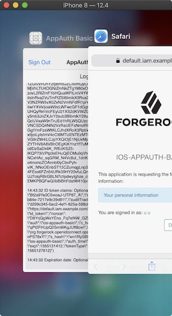
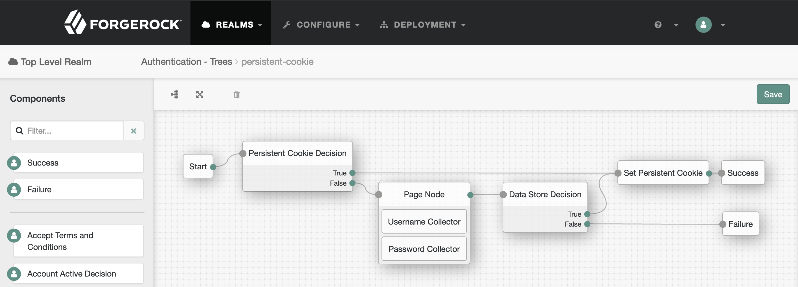
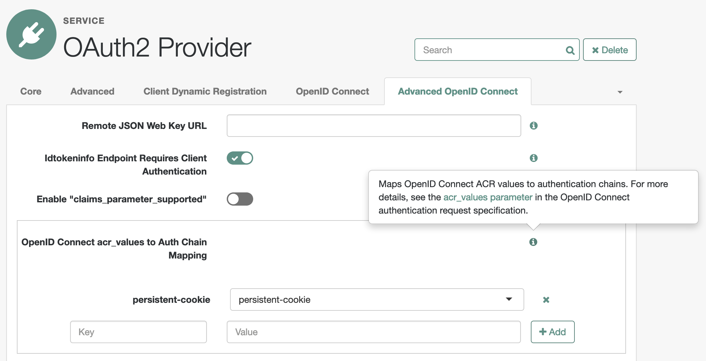
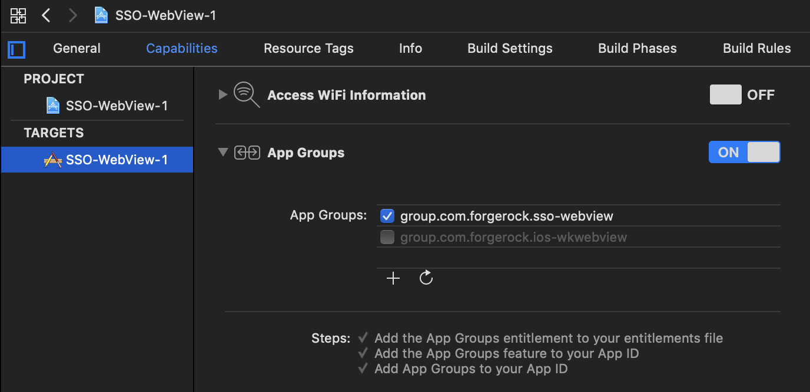
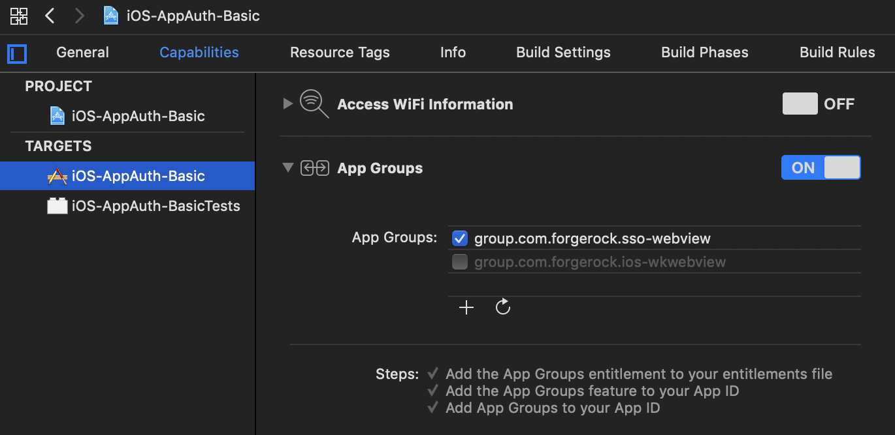
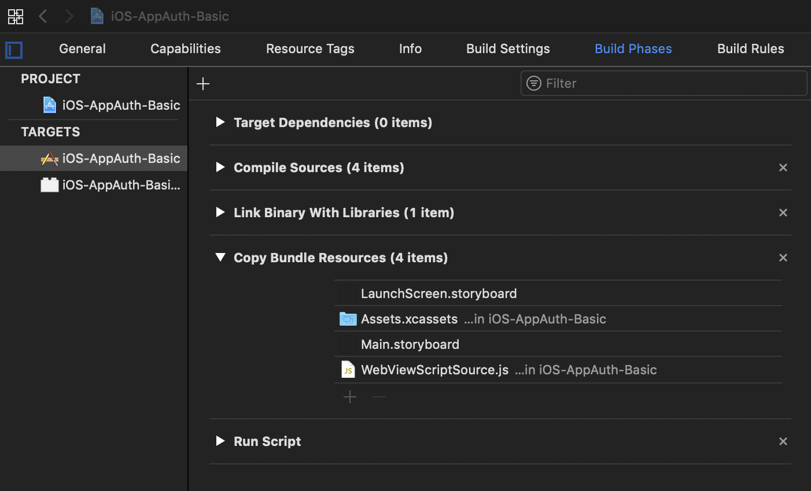

# <a id="top"></a> Implementing SSO with the AppAuth SDK for iOS

## Contents

* [Introduction](#introduction)
* [Selecting User-Agent](#selecting-user-agent)
* [Enabling Persistent Cookies in ForgeRock Access Management](#implementing-persistent-cookie-authentication-in-am)
* [Employing Embedded User-Agent](#embedded-user-agent)
* [Conclusion](#conclusion)

## <a id="introduction"></a> Introduction

This writing assumes familiarity with the content covered in [Implementing OAuth 2.0 Authorization Code Grant protected by PKCE with the AppAuth SDK for iOS](/iOS-AppAuth/README.md). In that article, we went over the best current practices for building OAuth 2.0 clients in native apps and described in details how to create a simple app serving the role of an OpenID Connect Relying Party with the help of the AppAuth SDK. Some of the examples here are based on the code from that simple app.

The AppAuth SDK for iOS employs an external user-agent for the front-channel communications. Doing so should provide the benefit of sharing session information existing in the user browser—thus, naturally allowing for the single sign-on (SSO) experience. This, however, comes with a limitation in iOS.

If the system browser was used as the external user-agent, no sharing of user's authentication state would be required. However, leaving an app and opening the default browser for authentication (and/or authorization) is generally considered to provide a poor user experience. Instead, the so called "in-app browser tabs" should be used for allowing the user to interact with the authorization server screens. Accordingly, by default, AppAuth calls Safari as the external user-agent only as a fall-back option, when in-app browser tabs are not available—that is, in iOS versions below 9.

In iOS 9-10, [SFSafariViewController](https://developer.apple.com/documentation/safariservices/sfsafariviewcontroller) is used as the user-agent. This class allows for sharing browser data, including authentication cookies, between its instances in iOS 9 and 10.

In iOS 11-12, designated authentication classes are used for interacting with the user:
* [ASWebAuthenticationSession](https://developer.apple.com/documentation/authenticationservices/aswebauthenticationsession) (iOS 12.0+)
* [SFAuthenticationSession](https://developer.apple.com/documentation/safariservices/sfauthenticationsession) (iOS 11.0–12.0 Deprecated)

> [According to Apple](https://developer.apple.com/support/app-store/), more than 90% of all devices are using iOS 11+.

In both cases, [session cookies](https://en.wikipedia.org/wiki/HTTP_cookie#Session_cookie) are not shared with Safari or other classes' instances, making SSO an option only with persistent cookies. Session cookies are never written to disk and, conceivably, present the more secure way of maintaining user session. It is possible, that your authorization server is using session cookies and, therefore, the SSO experience will not be automatically available with the AppAuth SDK for iOS.

> The authentication classes will ask the user for their consent to share the website data with the browser tab opened by the app. This means, that SSO experience in this case comes at the price of an extra action required from the user.

Here, we will discuss three options for enabling SSO with session cookies when it is not available by default in an OAuth 2.0 client built with AppAuth for iOS:

* Using Safari for user authentication will allow to share session cookies in all versions of iOS. This technique is described in the [Selecting User-Agent](#selecting-user-agent) section.

    PROS:
    - Full control over sharing browser data between authentication events

    CONS:
    - Authentication in Safari forces the user to leave the app
    - Safari tabs cannot be controlled from the app

* If calling the default browser for front-channel communications is not acceptable, enabling persistent cookies for session management could be an option in the authorization server configuration. This will allow for sharing authentication state in the iOS in-app browser tabs. An example of this approach is described in the [Enabling Persistent Cookies in ForgeRock Access Management](#implementing-persistent-cookie-authentication-in-am) section.

    PROS:
    - Supported with "out of the box" configuration of AppAuth for iOS

    CONS:
    - May require configuration changes in the authorization server

* Alternatively, a trusted app could be given access to the user session information and allowed to share it with other apps produced by the same development team, effecting SSO via the back-channel (that is, without the user being involved). A particular implementation of this method is demonstrated in the [Employing Embedded User-Agent](#embedded-user-agent) section.

    PROS:
    - Does not depend on the operating system policies
    - Does not require external user-agent

    CONS:
    - Requires inter-app communications; hence, works only for apps belonging to the same development team in iOS
    - May violate principles described in the best current practices for implementing OAuth 2.0 clients

The details for each implementation are outlined below.

## <a id="selecting-user-agent"></a> Selecting User-Agent

[Back to top](#top)

 In iOS 11+ session cookies are not shared with the in-app browser tabs. If your authorization server uses session cookies, as [ForgeRock Access Management](https://www.forgerock.com/platform/access-management/) does by default, SSO can be implemented with the default browser; doing so will still comply with the best current practices set out in [RFC 8252](https://tools.ietf.org/html/rfc8252).

Out of the box, AppAuth for iOS automatically selects an external user-agent based on conditions set in the [OIDExternalUserAgentIOS](https://github.com/openid/AppAuth-iOS/blob/e46bf966ba0189986f377719455c3656933a1566/Source/iOS/OIDExternalUserAgentIOS.m) class. Using the `OIDExternalUserAgent` interface, a modified copy of this class could be used for specifying an external user-agent explicitly, when the authorization flow is initiated. For example, using Safari as the user-agent in iOS 11-12 will allow for sharing session cookies.

An example of such custom version of the OIDExternalUserAgentIOS class can be found at [User-Agent/OIDExternalUserAgentIOSSafari.swift](User-Agent/OIDExternalUserAgentIOSSafari.swift). The key part of the class definition is the following statement, unconditionally opening the request URL in Safari:

```swift
// OIDExternalUserAgentIOSSafari.swift

// . . .

if #available(iOS 10.0, *) {
    openedSafari = UIApplication.shared.canOpenURL(requestURL!)

    UIApplication.shared.open(requestURL!, options: [:], completionHandler: nil)
} else {
    openedSafari = UIApplication.shared.openURL(requestURL!)
}

// . . .
```

When initiating the authorization request with AppAuth, create a new instance of the external user-agent with the new class. Then, if the request is initiated with the `OIDAuthState` automatic code exchange, provide the external user-agent instance as an argument to the `authState(byPresenting:externalUserAgent:callback:)` method in iOS 11+. For example:

```swift
// . . .

if #available(iOS 11.0, *) {
    let externalUserAgent = OIDExternalUserAgentIOSSafari(presentingViewController: self)

    appDelegate.currentAuthorizationFlow = OIDAuthState.authState(byPresenting: request, externalUserAgent: externalUserAgent) {
        authState, error in

        completion(authState, error)
    }
} else {
    appDelegate.currentAuthorizationFlow = OIDAuthState.authState(byPresenting: request, presenting: self) {
        authState, error in

        completion(authState, error)
    }
}

// . . .
```

Note, that by default, AppAuth for iOS will use `SFSafariViewController` as the user-agent in iOS versions 9 and 10. Unlike the authentication classes employed by AppAuth in iOS 11-12, `SFSafariViewController` can share session cookies between its instances; hence, the custom implementation of the external user-agent class is NOT used in the `else` clause.

If, on the other hand, you are using `OIDAuthorizationService` and manually exchange the authorization code for a token at the token endpoint, start the authorization flow with the `present(_:externalUserAgent:callback:)` method, providing the external user-agent instance as an argument. For example:

```swift
// . . .

let externalUserAgent = OIDExternalUserAgentIOSSafari(presentingViewController: self)

appDelegate.currentAuthorizationFlow = OIDAuthorizationService.present(request, externalUserAgent: externalUserAgent) {
    response, error in

    // . . .

    makeTokenRequest()
}

// . . .
```

Now, when the user authenticates to the authorization server from an app using Safari as the external user-agent, all browser information, including user's session, is naturally available on subsequent requests.

There are problems with this approach though. Leaving an app for authentication might be considered a less than ideal user experience. At least in the past, there have been reports ([example](http://www.openradar.appspot.com/19944416)) that App Store rejects apps using mobile Safari for signing in.

Another issue is that the Safari tab used for authentication will not be closed after the user is redirected back to the original app (in contrary to an in-app browser tab that can be dismissed by the app):



> In addition, when a [private-use (custom) URI scheme](https://tools.ietf.org/html/rfc8252#section-7.1) is used for redirection, Safari will prompt the user whether or not they want to open the app they are being redirected to. This does NOT happen when the user is redirected to the app via [Universal Links](https://developer.apple.com/ios/universal-links/), which is Apple's implementation of [claimed "https" scheme URIs](https://tools.ietf.org/html/rfc8252#section-7.2).

Selecting a particular user-agent may help with the opposite use case: when sharing browser data with an in-app browser tab is NOT needed. In iOS 13, setting the [prefersEphemeralWebBrowserSession](https://developer.apple.com/documentation/authenticationservices/aswebauthenticationsession/3237231-prefersephemeralwebbrowsersessio) property will allow to configure `ASWebAuthenticationSession` for a private session. The authentication classes used by AppAuth in iOS 11 and 12, `SFAuthenticationSession` and `ASWebAuthenticationSession` (respectively), do not offer this option. As a result, they always present a dialog box asking the user to provide their consent for sharing the website data and the existing session information.

`SFSafariViewController`, however, can be used for the private session experience in iOS 11 and 12, because it does not share anything between its instances and Safari in those environments. As an in-app browser tab, it lets user to stay in the app and can be dismissed after user interactions with the web site are no longer needed. In this case, a custom version of the `OIDExternalUserAgentIOS` class may be used to set the user-agent to `SFSafariViewController` in iOS 11 and 12. An example of such implementation can be found at [User-Agent/OIDExternalUserAgentIOSSafariViewController.swift](User-Agent/OIDExternalUserAgentIOSSafariViewController.swift).

> Currently, the `OIDExternalUserAgentIOS` class, included in the AppAuth SDK for iOS, does not accept arguments that would indicate which user-agent to utilize. Thus, maintaining your own custom copy of the class is necessary for selecting a particular user-agent.

In conclusion, selecting a user-agent is easy to implement in AppAuth for iOS without maintaining a custom version of the SDK. You would only need to extend the `OIDExternalUserAgent` interface with a custom version of the `OIDExternalUserAgentIOS` class.

## <a id="implementing-persistent-cookie-authentication-in-am"></a> Enabling Persistent Cookies in ForgeRock Access Management

[Back to top](#top)

[ForgeRock Access Management](https://www.forgerock.com/platform/access-management/) (AM) can serve the role of an [OpenID Provider](https://openid.net/specs/openid-connect-core-1_0.html#Terminology). By default, it is using session cookies, which are not shared by any of the in-app browser tabs in iOS 11+. As noted in the previous section, using Safari for user authentication has its drawbacks.

Authentication based on persistent cookies can be implemented in AM by utilizing [Authentication Trees](https://backstage.forgerock.com/docs/am/6.5/authentication-guide/#sec-configure-authentication-trees). A simplified example of such tree may look like this:



The tree identifier needs to be mapped in OAuth2 Provider service settings in AM to an [OIDC Authentication Context Class Reference](https://openid.net/specs/openid-connect-core-1_0.html#IDToken) (ACR) value. For example:



Then, the mapped ACR value could be provided as an additional parameter in the authorization request built by AppAuth. For example:

```swift
// Building authorization request.
let request = OIDAuthorizationRequest(
    configuration: configuration,
    clientId: clientId,
    clientSecret: nil,
    scopes: scopes,
    redirectURL: redirectURI,
    responseType: OIDResponseTypeCode,
    additionalParameters: ["acr_values": "persistent-cookie"]
)
```

> The example above is based on the code from [iOS-AppAuth-Basic](/iOS-AppAuth/iOS-AppAuth-Basic) app.

If your user has already been authenticated to AM in a non-private session using the persistent cookie set in this authentication tree, the cookie will be shared with other non-private sessions utilizing the same tree and will allow for SSO until the cookie is expired. For example, you could initiate an authorization flow in another AppAuth app with the same additional parameters, or you could sign in by navigating to the AM web site in Safari and specify the authentication tree with the `service` parameter:

https://default.iam.example.com/am/?service=persistent-cookie

> According to a [report](http://www.openradar.me/radar?id=5036182937272320), cookie sharing between `SFAuthenticationSession` and Safari used to be delayed/unreliable in iOS 11. We don't have a confirmation of this issue in the later versions of iOS.

## <a id="embedded-user-agent"></a> Employing Embedded User-Agent

[Back to top](#top)

* [Introduction](#embedded-user-agent-introduction)
* [Simple Web View App](#embedded-user-agent-simple-web-view-app)
* [AppAuth-iOS Web View App](#embedded-user-agent-appauth-ios-web-view-app)
* [JavaScript Messaging](#embedded-user-agent-javascript-messaging)

### <a id="embedded-user-agent-introduction"></a> Introduction

AppAuth for iOS follows the best current practices (BCP) outlined in RFC 8252, and calls for an external user-agent to initiate the authorization request. Doing so provides both usability and security benefits: the browser existing authentication state can be shared, system-wide tools (like password managers) could be utilized—providing consistent user experience, and user's credentials are not exposed to the app.

There are some limitations and downsides associated with this strategy. Sharing session information with the in-app browser tabs is not always readily available in iOS. In addition, in iOS 11+ the user is informed about starting a non-private browser session in the app via a dialog that necessitates an extra input from the user. In addition to that, the external user-agents provide limited options for blending the authentication web page into the app's general design.

Potentially, apps could share user's authentication state directly, not relying on its persistence in the system browser. For example, collecting user's credentials via an embedded user-agent and performing authentication from inside the app code would allow for reusing existing web authentication methods and provide access to the session cookies. In addition, embedding a browser in the app would help with seamless integration of the authentication UI. This approach, however, is strongly discouraged by the BCP.

 In regard to the security and privacy considerations, the BCP are mostly written with the third-party clients in mind.

> You can think of the first two parties as ones being bound by a contract. For example, in OAuth 2.0 terms, the first two are represented by the resource owner and the system providing access to their resources, the authorization server and the resource server. The client software arrives later on the scene and, unless it is directly controlled by the authorization system, is the third party, which is not a subject to the contract.

Third-party apps belong to security domains separate from the one where user's identity is being maintained. Providing user's credentials to a third-party app, as the means for verifying user's identity, would allow the third-party to access resources that it does not manage and should only be able to utilize with the user's consent. In order for the user's identity and its authentication status to be shared across the trust boundary, a trusted communication channel needs to be established between the Identity Provider (IdP) and the third-party software. This could be done with the help of various federation protocols, which employ digital signing and encryption for setting trusted relationships. With this federation in place, a user can authenticate to an Identity Provider with an external system tool, like a browser, which the third party has no control of; then, the user's identity is confirmed to the third-party app with the means provided by the trusted relationship.

In the case of OAuth 2.0 clients, federation could be implemented with policies defined in the [OpenID Connect](https://openid.net/connect/) (OIDC) standard, which extends the OAuth 2.0 framework. The OIDC layer allows to communicate user's identity via an [ID Token](https://openid.net/specs/openid-connect-core-1_0.html#IDToken), which contains information about the user's authentication. Sharing this information with another app, by itself, does not let the other app to authenticate the user to the authorization server via a back-channel. An additional protocol needs to be adopted by the client and by the authorization server to enable such authentication with the means of an ID Token. Currently, there is only a draft for [OpenID Connect Native SSO for Mobile Apps](https://openid.net/specs/openid-connect-native-sso-1_0.html), which describes additional specifications and their use for allowing a mobile app to share the identity/authentication info with another mobile app issued by the same vendor (but not necessarily by the company hosting the authorization server).

> It is also possible that there is no need for federating identity, and all the client software needs is authorization from the user to access protected resources on their behalf. In that case, authenticating the user _to the client_ against their identity manged by the OIDC Provider may be omitted. The need for SSO, however, may remain.

All of this changes when the client software is created and controlled by the first party. The first-party software represents the business entity which has full access to user's resources and which maintains and protects them. Because of this, the first-party software is inherently trusted by the user, and providing user's credentials directly to a first-party app may be an acceptable way of identifying the user. This makes federation and extra efforts associated with its implementation unnecessary and providing less prominent security benefits.

> One may even argue that providing user's credentials to a first-party app may expose a lesser attack surface than by sharing the credentials with the default system browser. The latter option, however, could contribute to overall security by integrating with system tools; for example, access to the system password manager could make entering user's credentials an easy and secure process.

The notion of a first-party app introduces a double-standard. The end user is not to enter their credentials directly in a third-party software, but it is OK to do so with the first-party applications. Ideally, in order to provide a secure environment, the operating system needs to make a distinction between the trusted and non-trusted apps. In that regard, the app review process and a [mobile device management](https://en.wikipedia.org/wiki/Mobile_device_management) implementation may help to prevent a third party from accessing user's credentials.

> While a good acting third-party app would probably adopt the standards, a malicious app is under no obligation to follow this admirable practice. There have been opinions raised and requests made ([example](https://openradar.appspot.com/radar?id=4963695432040448)) to limit use of embedded user-agents in iOS apps. At the same time, as noted in the [Fake External User-Agents section of RFC 8252](https://tools.ietf.org/html/rfc8252#section-8.7), the very presence of embedded user-agents, even in the first-party apps, makes it more difficult to detect bad actors that could use the native controls to steal user information.

In practice, however, decisions on whether to trust their credentials to an app are often taken to the end user, which represents a black box with unknown but reliably inconsistent properties.

> [Section 5.5 of OAuth 2.0 Threat Model and Security Considerations](https://tools.ietf.org/html/rfc6819#section-5.5) depicts some downsides of relying on user to operate as a security system component. The concerns brought up by the RFC can only be addressed in a specially controlled environment.
>
> It is worth to note, that all these concerns we discuss here are not specific to OAuth 2.0 implementations. While identity providers ([example 1](https://developers.googleblog.com/2016/08/modernizing-oauth-interactions-in-native-apps.html) and [example 2](https://dev.fitbit.com/build/reference/web-api/oauth2/#obtaining-consent)) may try to prevent use of embedded browsers for authorization flows, user's credentials by themselves present a security threat when in possession of a malicious party.

In the end, the first-party apps do exist, and user authentication with native code does take place, opening the door for developers to provide uninterrupted user experience, and for users to share their credentials with the apps. It is expected that the end user can recognize the first party software and will enter appropriate credentials when prompted for signing in.

With access to user's credentials and to their session information, SSO can be implemented in a proprietary way with other apps belonging to the same organization. iOS provides means of exchanging data between apps in a group defined by a development team; thus, the authentication state can be shared and SSO can be effected outside of the default browser environment.

The in-app authentication could be built with elementary native controls, allowing for almost infinite flexibility in its realization, including the presentation part and integrating the authentication UI into the rest of the app. This is a probable approach for an SDK developed by the first party. Particularities of a given SDK is beyond the scope of this general discussion.

The more generic option for building an embedded user-agent could be utilizing a prebuilt web view component provided by the operating system. A web view allows for automatic rendering of web pages that are already prepared for the browsers. In recent versions of iOS, the [WKWebView](https://developer.apple.com/documentation/webkit/wkwebview) class represents such component. We will demonstrate how it could be used for furnishing SSO experience between first-party apps. We will also show how the AppAuth SDK for iOS could still be employed for completing the OAuth 2.0 authorization flow after the user authenticates to the authorization server with the native control.

> While no federated authentication may be required in this case, OAuth 2.0 flows may still need to be performed according to the standards and existing authorization policies.

For this, we will need two apps belonging to the same [App Group](https://developer.apple.com/documentation/bundleresources/entitlements/com_apple_security_application-groups). The final result will look and act similar to this [short video](https://forgerock.wistia.com/medias/nyu5fpq8hx).

### <a id="embedded-user-agent-simple-web-view-app"></a> Simple Web View App

[Back to Employing Embedded User-Agent](#embedded-user-agent)

The full code example can be found under [WebView/SSO-WebView-1/](WebView/SSO-WebView-1/). You can build your own version by following the general steps outlined below:

0. Create a new iOS Single View App project in Xcode. Select Swift as the language.

0. Under the target properties, in Capabilities, enable App Groups.

    You will be asked to select your development team, and you will need an Apple Developer account in order to add the App Groups entitlement.

    In App Groups, add a group of your choice, for example: `group.com.forgerock.sso-webview`.

    The App Groups entitlement will allow the app to share data with other apps in the same group, developed by the same team.

    For example:

    

    > In this example, we assume that cookies for only one App Group need to be manged, but the implementation could be easily extended to handle multiple groups associated with the app, by creating group specific storage locations.

0. In Xcode, create a new Swift file for iOS: File > New > File...; for example: `WebViewController.swift`.

    This file will define a class, which creates a [WKWebView](https://developer.apple.com/documentation/webkit/wkwebview) instance and, optionally, handles its navigation events. During authentication, it will capture authentication cookies and store them in a [UserDefaults](https://developer.apple.com/documentation/foundation/userdefaults) database associated with the App Group this app belongs too. Other apps in the same group will be able to read the cookies. The class instance will check the database for authentication cookies presence and, if found, inject them in the WKWebView instance—thus, authenticating the user automatically when it is possible.

    > [Keychain Sharing](https://developer.apple.com/documentation/security/keychain_services/keychain_items/sharing_access_to_keychain_items_among_a_collection_of_apps) provides a more secure option for persistent types of sensitive data and is recommended for production use. This technique deserves its own deliberation and is not covered here. For these demo apps, storing _temporary_, _user specific_ credentials (like cookies and other short lived tokens) in unencrypted form may be sufficient. Foreign apps will not be able to access the group data at the run time.

    Sounds pretty bad so far, right? Well, that is how the "double standard" manifests in this case. The first-party apps, controlled by a development team representing a business entity, _are_ trusted by the user authenticating to the same party. There is no fundamental requirement for a business entity (including one represented by the user) to hide anything from itself. A given app, of course, should be limited in its capabilities depending on the environment it operates in, and a given user should have limited access to the system, but the apps installed on the same iOS device and belonging to the same party shouldn't need to hide the user's authentication information from each other.

    > In iOS, multi-user environment is not supported out of the box.

    The entire content of the class could be found at [WebView/SSO-WebView-1/SSO-WebView-1/WebViewController.swift](WebView/SSO-WebView-1/SSO-WebView-1/WebViewController.swift)

    The key elements of this class are these:

    0. We need to create a WKWebView instance; hence the [WebKit](https://developer.apple.com/documentation/webkit) framework is imported.

    0. We initialize the class with parameters describing what URL to initiate the web view with, what cookies to track, and what App Group to make those cookies available for. The frame to render the web view instance in and the web view configuration parameters could also be provided.

    0. We include a default [WKNavigationDelegate](https://developer.apple.com/documentation/webkit/wknavigationdelegate), with an option for the caller of this class to specify their own.

        Depending on how the web view is used, navigation events could be handled differently. For example, during the OAuth 2.0 authorization, you will need to detect the redirection URI and parse its data, while another application in the App Group may not employ OAuth 2.0 and its redirection flows at all.

        > The custom navigation handlers could be defined via parameters passed to the class and implemented with some conditional logic inside it. On the other hand, processing navigation events outside of the class is, arguably, a more flexible approach, and that is what we implement in this example.

    0. We capture cookies in a web view navigation event.

        We could, theoretically, use [WKHTTPCookieStoreObserver](https://developer.apple.com/documentation/webkit/wkhttpcookiestoreobserver) for this purpose, but it proved unreliable in my experience and tended to stop working under certain conditions.

    0. The class will host methods for storing and retrieving selected (authentication) cookies.

        Maintaining user session and other App Group data could also be done in a separate module; for example, one that is dedicated to session management. In this example, however, we are only trying to demonstrate the role of a web view in the authentication process and not how the code should be organized.

    0. The class will expose a public `loadWebView(completion:)` method that instantiates a web view instance and makes it available for the caller via the completion handler.

        If any authentication cookies are found in the App Group database, they will be injected in the web view before loading the initial URL.

0. In the main view controller—ViewController.swift, by default—we will instantiate the previously defined class, call its `loadWebView(completion:)` method, and add the resulting web view as a subview to the root view of the controller.

    When creating a web view instance you will need to provide a URL to load, the name of the App Group to share cookies with, the authentication cookie name(s) to track, and, optionally, a [CGRect](https://developer.apple.com/documentation/coregraphics/cgrect) location to place the web view at. For example:

    ```swift
    //  ViewController.swift

    import UIKit

    class ViewController: UIViewController {
        var webViewController: WebViewController!

        // . . .

        /**
        ForgeRock 7 example.
        */

        webViewController = WebViewController.init(
            initialUrl: "https://default.iam.example.com/enduser/",
            appGroup: "group.com.forgerock.sso-webview",
            appGroupCookies: ["iPlanetDirectoryPro"],
            webViewFrame: self.view.bounds
        )

        // . . .

    }
    ```

    >  No WKWebViewConfiguration will be used and no custom WKNavigationDelegate will be specified in this case.

0. Optionally, create a simple UI to load the web view on demand.

    In the provided code sample, the UI layout is defined programmatically, in [WebView/SSO-WebView-1/SSO-WebView-1/AppDelegate.swift](WebView/SSO-WebView-1/SSO-WebView-1/AppDelegate.swift), in the `application(_:didFinishLaunchingWithOptions:)` method. You can use storyboard for the same purpose, if that is your preference. You can also choose to require no interaction from the user and display no navigation items, loading the web view automatically.

Signing in at the provided URL in this example will save authentication cookies in the App Group specific location; thus, making the cookies available for another app belonging to the same group.

If you built and run the example app, it should take you to the authentication endpoint and let to sign in. Subsequent requests to this site in a web view created with the WebViewController class and instantiated with the same authentication parameters should not require user to authenticate again, unless the user's session is expired.

### <a id="embedded-user-agent-appauth-ios-web-view-app"></a>AppAuth-iOS Web View App

[Back to Employing Embedded User-Agent](#embedded-user-agent)

In this app, we will try to reuse existing authentication information, and also perform an authorization flow with the help of the AppAuth SDK for iOS.

To highlight the essence of this implementation, we will modify an existing app described in [Implementing OAuth 2.0 Authorization Code Grant protected by PKCE with the AppAuth SDK in iOS apps](/iOS-AppAuth/README.md). The original app authenticates with external user-agent called up by AppAuth. We will authenticate with a web view instead and then continue the authorization flow with the methods provided by the SDK. All identity provider references—like URI-s, cookie names, etc.—will be incidental here and serve only as examples. You can replace them with your own identity provider specifics.

The full code example can be found at [WebView/iOS-AppAuth-Basic/](WebView/iOS-AppAuth-Basic/). It was built by following a procedure outlined below:

0. Make a copy of the app located at [/iOS-AppAuth/iOS-AppAuth-Basic/](/iOS-AppAuth/iOS-AppAuth-Basic/).

0. In the root of that folder, run:

    ```bash
    carthage bootstrap --platform iOS
    ```

    You can also try to update the library content with the latest:

    ```bash
    carthage update --platform iOS
    ```

0. Add a copy of the WebViewController.swift file (created in the previous section) to this project.

0. Optionally, in Xcode change the project's Display Name and bundle identifier—just to indicate that it uses a web view instead of an external user-agent.

0. Under the target properties, in Capabilities, enable App Groups and select your development team.

    In App Groups add _the same_ group as the one we created for the first app; here, it is: `group.com.forgerock.sso-webview`.

    For example:

    

0. In ViewController.swift, add following properties to the main class:

    ```swift
    // ViewController.swift

    // . . .

    class ViewController: UIViewController {
        // . . .

        /**
        App Group name.

        Serves as a reference to the App Group for sharing the authentication state.
        */
        let appGroup = "group.com.forgerock.sso-webview"

        /**
        Cookies to be shared with the App Group.
        */
        let appGroupCookies = ["iPlanetDirectoryPro"]

        /**
        Reference to a request object built by AppAuth.

        This will be used to build AppAuth `OIDAuthorizationResponse` to continue authorization with the SDK after redirection event in the web view.
        */
        var oidAuthorizationRequest: OIDAuthorizationRequest? = nil

        /**
        Reference to the class providing web view.
        */
        var webViewController: WebViewController!

        /**
        Reference to the web view via its `tag` property.
        */
        var webViewTag = 1

        /**
        Completes successful authorization.

        This property serve as a placeholder for authorization completion handler for being called from a different context than one the authorization was initiated in. In this example, it sets the authorization state and performs callbacks—if any.
        */
        var authorizationCompletion: ((OIDAuthState?, Error?) -> Void)? = nil

        // . . .
    }

    // . . .
    ```

    These properties will allow for instantiating a web view and using it for interacting with the user in the authorization process.

0. In the main view controller, add a new `authorizeWithWebView(configuration:clientId:redirectionUri:scopes:completion:)` method, which will instantiate the web view with the URL for authorization endpoint. For example:

    ```swift
        //  ViewController.swift

        // . . .

        // MARK: Authorization methods
        extension ViewController {
            // . . .

            /**
            Performs the authorization code flow using a web view.

            Attempts to make a request to the authorization endpoint by utilizing a web view.
            Allows the web view to handle the redirection.
            */
            func authorizeWithWebView(
                configuration: OIDServiceConfiguration,
                clientId: String,
                redirectionUri: String,
                scopes: [String] = [OIDScopeOpenID, OIDScopeProfile],
                completion: @escaping (OIDAuthState?, Error?) -> Void
                ) {
                // Checking if the redirection URL can be constructed.
                guard let redirectURI = URL(string: redirectionUri) else {
                    print("Error creating redirection URL for : \(redirectionUri)")

                    return
                }

                // Building authorization request.
                let request = OIDAuthorizationRequest(
                    configuration: configuration,
                    clientId: clientId,
                    clientSecret: nil,
                    scopes: scopes,
                    redirectURL: redirectURI,
                    responseType: OIDResponseTypeCode,
                    additionalParameters: nil
                )

                // Making authorization request.

                print("Initiating authorization request with scopes: \(request.scope ?? "no scope requested")")

                // Using web view instead of built in AppAuth methods invoking an external user-agent.

                /**
                Reference to the completion handler to be called on successful authorization.

                The redirection URI will be processed in the web view navigation event. The code will be exchanged for tokens using the `makeTokenRequest()` method, which will need to follow by the completion callback passed in here from the `authorizeRp()` method. Since the navigation event will be handled in a different context, we need to preserve the completion block.
                */
                authorizationCompletion = completion

                /**
                The request object reference accessible from other methods.

                AppAuth methods will be used to complete the authorization flow after redirection from the authorization endpoint and need the original request details.
                */
                oidAuthorizationRequest = request

                // Dismissing any existing subview.
                view.viewWithTag(webViewTag)?.removeFromSuperview()

                // Dismissing any existing web view controller.
                webViewController = nil

                // Providing the web view class with initial parameters, including the URL to the authorization endpoint obtained from the AppAuth authorization request object.
                webViewController = WebViewController.init(
                    initialUrl: request.authorizationRequestURL().absoluteString,
                    appGroup: appGroup,
                    appGroupCookies: appGroupCookies,
                    webViewFrame: view.bounds
                )

                // Setting this controller as the web view navigation delegate.
                webViewController.wkNavigationDelegate = self

                // Loading the view with the authorization URL.
                webViewController.loadWebView() {
                    webView in

                    // Tracking the view by its tag.
                    webView.tag = self.webViewTag

                    self.view.addSubview(webView)
                }

                // . . .
            }

            // . . .
        }
    ```

0. To use the web view in the authorization flow, the redirection response from the authorization endpoint will need to be handled in the view's WKNavigationDelegate.

    The default implementation of the WebViewController class does not have a special handler for navigation action from the authorization endpoint. The class could, in theory, accept a parameter defining this behavior; however, having its own version of the entire delegate provides the calling class with more freedom in responding to navigation events.

    > For handling redirection with a [private-use (custom) URI scheme](https://tools.ietf.org/html/rfc8252#section-7.1), you could use [WKURLSchemeHandler](https://developer.apple.com/documentation/webkit/wkurlschemehandler). Intercepting a navigation action, however, provides a more reliable and generic way to process the redirection URI. As was explained in [Implementing OAuth 2.0 Authorization Code Grant protected by PKCE with the AppAuth SDK in iOS apps](/iOS-AppAuth/README.md), custom URI schemes, in comparison to Universal Links, are the less secure option when used in OAuth 2.0 redirection flows. Universal Links utilize "https" scheme, which WebKit already knows how to handle.

    Import the WebKit framework in the main view controller to make the WKNavigationDelegate protocol available:

    ```swift
    //  ViewController.swift

    // . . .

    import WebKit

    // . . .
    ```

    Add an extension to the main view controller that will adopt the WKNavigationDelegate protocol. You could use the content of the default WKNavigationDelegate delegate definition from WebViewController.swift as a starting point, or define the new delegate from scratch. Then, modify the `webView(_:decidePolicyFor:decisionHandler:)` method so that redirection data from the authorization endpoint could be processed and the cookies from the authorization endpoint domain could be saved. For example:

    ```swift
    //  ViewController.swift

    // . . .

    // MARK: Delegate for the web view navigation events.
    extension ViewController: WKNavigationDelegate {
        // . . .

        func webView(_ webView: WKWebView, decidePolicyFor navigationAction: WKNavigationAction, decisionHandler: @escaping (WKNavigationActionPolicy) -> Void) {
            print("Navigation—action URL: ", navigationAction.request.url?.absoluteString ?? "")

            /**
            Handling the redirect from the authorization endpoint.

            Alternatively, for a custom URI scheme, one could use WKURLSchemeHandler; for example:
                let configuration = WKWebViewConfiguration()
                configuration.setURLSchemeHandler(your-class-adopting-the-WKURLSchemeHandler-protocol, forURLScheme: redirectionUriScheme)
                webView = WKWebView(frame: webViewFrame, configuration: configuration)
            */
            if navigationAction.request.url?.absoluteString.starts(with: redirectionUri) ?? false {
                print("Redirection URI: ", navigationAction.request.url?.absoluteString ?? "")

                /**
                Redirection URI query parameters.
                */
                var parameters: [String : String] = [:]

                if let urlComponents = URLComponents(url: navigationAction.request.url!, resolvingAgainstBaseURL: false) {
                    let queryItems: [URLQueryItem]? = urlComponents.queryItems

                    if let queryItems = queryItems {
                        parameters = queryItems.reduce(into: parameters) {result, queryItem in
                            result[queryItem.name] = queryItem.value
                        }
                    }
                }

                // Checking if the web view is associated with an OIDAuthorizationRequest.
                if let oidAuthorizationRequest = oidAuthorizationRequest {
                    // Creating an OIDAuthorizationResponse to initiate token exchange request with.
                    let oidAuthorizationResponse = OIDAuthorizationResponse(request: oidAuthorizationRequest, parameters: parameters as [String : NSCopying & NSObjectProtocol])

                    // Verifying that the state in the response matches the state in the request.
                    if oidAuthorizationRequest.state == oidAuthorizationResponse.state, let _ = oidAuthorizationResponse.authorizationCode {
                        // Saving the response in the authentication state object.
                        let authState = OIDAuthState(authorizationResponse: oidAuthorizationResponse)

                        // Saving the authorization state.
                        setAuthState(authState)

                        // Performing the token exchange and providing the callback on completion.
                        makeTokenRequest() {
                            authState, error in

                            self.authorizationCompletion?(authState, error)
                        }
                    } else {
                        setAuthState(nil)
                    }

                    decisionHandler(.cancel)

                    view.viewWithTag(webViewTag)?.removeFromSuperview()

                    webViewController = nil

                    return
                }
            }

            // Allowing navigation to and saving cookies from the issuer site.
            if navigationAction.request.url?.host == (URL(string: issuerUrl))?.host {
                decisionHandler(.allow)

                // Capturing (authentication) cookies when they are present—after signing in at the authentication endpoint.
                WKWebsiteDataStore.default().httpCookieStore.getAllCookies() {
                    cookies in

                    let cookies = cookies.filter {
                        self.appGroupCookies.contains($0.name)
                    }

                    guard cookies.count > 0 else {
                        return
                    }

                    self.webViewController.saveCookies(cookies)
                }

                return
            }

            print("Cancelling navigation to: ", navigationAction.request.url?.absoluteString ?? "")

            decisionHandler(.cancel)
        }

        // . . .
    }
    ```

    Note, that the cookies from the issuer domain are saved with the public method defined in WebViewController.swift:

    ```swift
    self.webViewController.saveCookies(cookies)
    ```

0. Now, you can call the new `authorizeWithWebView(configuration:clientId:redirectionUri:scopes:completion:)` method from `authorizeRp(issuerUrl:configuration:completion:)`:

    ```swift
        //  ViewController.swift

        // . . .

        // MARK: Authorization methods
        extension ViewController {
            // . . .

            /**
            Authorizes the Relying Party with an OIDC Provider.

            - Parameter issuerUrl: The OP's `issuer` URL to use for OpenID configuration discovery
            - Parameter configuration: Ready to go OIDServiceConfiguration object populated with the OP's endpoints
            - Parameter completion: (Optional) Completion handler to execute after successful authorization.
            */
            func authorizeRp(issuerUrl: String?, configuration: OIDServiceConfiguration?, completion: (() -> Void)? = nil) {
                /**
                Performs authorization with an OIDC Provider configuration.

                A nested function to complete the authorization process after the OP's configuration has became available.

                - Parameter configuration: Ready to go OIDServiceConfiguration object populated with the OP's endpoints
                */
                func authorize(configuration: OIDServiceConfiguration) {
                    print("Authorizing with configuration: \(configuration)")

                    self.authorizeWithWebView(
                        configuration: configuration,
                        clientId: self.clientId,
                        redirectionUri: self.redirectionUri
                    ) {
                        // . . .
                    }

                    // . . .
                }

                // . . .
            }

            // . . .
        }

        // . . .
    ```

If you build and run the app now, the web view will appear in the provided frame loading the specified URL. If the cookies have been saved in the App Group database, the view should take the user to the authorization endpoint or to the consent screen, if one is displayed by the server, bypassing the login prompt.

### <a id="embedded-user-agent-javascript-messaging"></a> JavaScript Messaging

[Back to Employing Embedded User-Agent](#embedded-user-agent)

Signing in process may require additional information exchange between the native environment and the authentication system—for example, communicating device information or leveraging multi-factor authentication. While a prebuilt solution like WKWebView impose certain constrains in this regard, it is still possible to establish such communication. For that purpose, I am afraid, we will have to use JavaScript!

Imagine, that on an authentication page there is some dynamic content calling for an action to be performed by the native client, the results of which need to be reported back to the web application.

We will imitate this dynamic web content with a JavaScript injected into the web view content from a source file. For example:

```javascript
//  WebViewController.js

(function () {
    if (window.webkit) {
        var response = {
            "authId": "authId",
            "callbacks": [
                {
                    "type": "Code",
                    "input": [],
                    "output": []
                }
            ]
        }

        window.webkit.messageHandlers.callback.postMessage(JSON.stringify(response))
    }
}())
```

The posted "callback" message represents a hypothetical request for an action from the authentication endpoint to the native app. We will accommodate the message format in a codable structure:

```swift
//  AuthenticationResponse.swift

import Foundation

/**
Container for JSON callbacks expected from the authentication endpoint.
*/
struct AuthenticationResponse: Codable {
    struct Callback: Codable {
        let type: String?
    }

    let authId: String?
    var callbacks: [Callback] = []
}
```

In order for the source file to be available at the run time, it will need to be added to the app bundle in Target > Build Phases > Copy Bundle Resources. For example:



> For imitation of a JavaScript code running on a web page, we could use [evaluateJavaScript(_:completionHandler:)](https://developer.apple.com/documentation/webkit/wkwebview/1415017-evaluatejavascript) for executing the statement included in WebViewController.js. However, storing JavaScript content in a file seems to be a solution that is easier to read and maintain.

In order to be able to inject scripts and handle messages received from the web view content we will need to configure the web view with the [WKUserContentController](https://developer.apple.com/documentation/webkit/wkusercontentcontroller) class and adopt the [WKScriptMessageHandler](https://developer.apple.com/documentation/webkit/wkscriptmessagehandler) protocol.


Add the following extension, conforming to the WKScriptMessageHandler protocol, to the main view controller:

```swift
// ViewController.swift

// . . .

// MARK: Conforming to WKScriptMessageHandler protocol
extension ViewController: WKScriptMessageHandler {
    func userContentController(_ userContentController: WKUserContentController, didReceive message: WKScriptMessage) {
        print(#function)

        if message.name == "callback", let messageBody = message.body as? String, let messageBodyData = messageBody.data(using: .utf8) {
            let decoder = JSONDecoder()
            var messageBodyJson: AuthenticationResponse?

            do {
                messageBodyJson = try decoder.decode(AuthenticationResponse.self, from: messageBodyData)

                messageBodyJson?.callbacks.forEach {
                    callback in

                    if callback.type == "code" {
                        /**
                        Example action against the web content.
                        */
                        let scriptSource = "document.body.style.backgroundColor = 'lightgreen'"

                        // Example action performed in the native app.

                        let webView = self.view.viewWithTag(webViewTag) as? WKWebView

                        let alert = UIAlertController(title: "Native Prompt", message: "Enter the code. \nThe correct one is: 0000", preferredStyle: UIAlertController.Style.alert)

                        alert.addTextField() {
                            textField in

                            alert.addAction(
                                UIAlertAction(title: NSLocalizedString("Cancel", comment: "Cancel Action"), style: UIAlertAction.Style.cancel) {
                                    (_: UIAlertAction) in

                                    webView?.removeFromSuperview()
                                }
                            )

                            alert.addAction(
                                UIAlertAction(title: NSLocalizedString("Submit", comment: "Submit Action"), style: UIAlertAction.Style.default) {
                                    (_: UIAlertAction) in

                                    let newValue = textField.text?.trimmingCharacters(in: .whitespacesAndNewlines)

                                    if (newValue != "0000") {
                                        webView?.removeFromSuperview()
                                    } else {
                                        // Performing the action against the web content.
                                        webView?.evaluateJavaScript(scriptSource, completionHandler: nil)
                                    }
                                }
                            )
                        }

                        present(alert, animated: false)
                    }
                }
            } catch {
                print("Error decoding callback message: ", error.localizedDescription)
            }
        }
    }
}
```

This example implementation of [userContentController(_:didReceive:)](https://developer.apple.com/documentation/webkit/wkscriptmessagehandler/1396222-usercontentcontroller) will respond to the "callback" message, process its data, invoke an action in the native app, and respond back to the page with an action against the web content.

> The example actions here serve only demonstrational purposes and could be replaced with some meaningful information exchange between the native app and the authorization server front-end.

You can now add WKUserContentController to the web view configuration and use its [add(_:name:)](https://developer.apple.com/documentation/webkit/wkusercontentcontroller/1537172-add) method to register a message handler for the "callback" name we used in the WebViewController.js script. For example:

```swift
// ViewController.swift

// . . .

// MARK: Authorization methods
extension ViewController {

    // . . .

    func authorizeWithWebView(
        configuration: OIDServiceConfiguration,
        clientId: String,
        redirectionUri: String,
        scopes: [String] = [OIDScopeOpenID, OIDScopeProfile],
        completion: @escaping (OIDAuthState?, Error?) -> Void
        ) {

        // . . .

        // Configuring the web view for JavaScript interactions.

        let userContentController = WKUserContentController()
        userContentController.add(self, name: "callback")

        let configuration = WKWebViewConfiguration()
        configuration.userContentController = userContentController

        // Providing the web view class with initial parameters, including the URL to the authorization endpoint obtained from the AppAuth authorization request object.
        webViewController = WebViewController.init(
            initialUrl: request.authorizationRequestURL().absoluteString,
            appGroup: appGroup,
            appGroupCookies: appGroupCookies,
            webViewFrame: view.bounds,
            webViewConfiguration: configuration
        )

        // . . .

        }
    }

    // . . .
}

// . . .
```

Now, when you build and run the app, you'll be greeted with a native prompt initiated from the JavaScript code on the web page. Responding to the prompt will execute a JavaScript function on the web page, manifesting itself as the page background change.

Utilizing a web view allows for reusing functionality already built for the browsers. Building your own embedded browser, with more elementary native controls, may be beneficial in highly specialized cases. It would, however, require replicating the web functionality with native means and maintaining it separately from the web content.

# <a id="conclusion"></a> Conclusion

[Back to top](#top)

There seem to be no ideal solution for implementing SSO based on browser cookies in iOS in a way that is compliant with the best current practices and recommendations for OAuth 2.0 clients. In this overview, we extended our experience with the AppAuth SDK for iOS by describing a few additional options for enabling SSO when it is not available with the SDK "out of the box".
