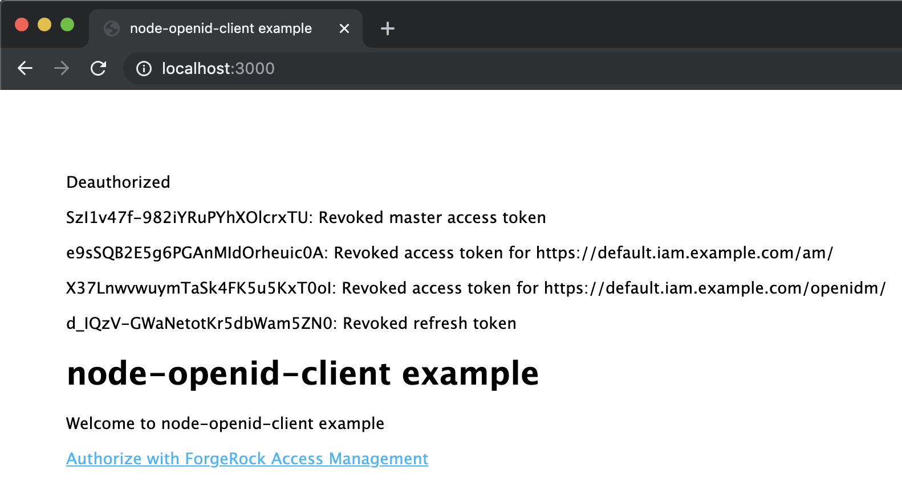

# <a id="top"></a> Building an OAuth 2.0 Client with the openid-client and openid-client-helper Libraries in Node.js

[OAuth 2.0](https://tools.ietf.org/html/rfc6749) and [OpenID Connect](https://openid.net/specs/openid-connect-core-1_0.html) (OIDC) will be the context for this document and for the project it describes.

## Contents

* [Introduction](#intro)
* [Sample Application](#sample)
* [Conclusion](#conclusion)

## <a id="intro"></a> Introduction

[Back to top](#top)

This example of an OAuth 2.0 [client](https://tools.ietf.org/html/rfc6749) extended to OIDC [relying party](https://openid.net/specs/openid-connect-core-1_0.html#Terminology) relies on [openid-client](https://www.npmjs.com/package/openid-client), a certified OIDC library. The library provides a comprehensive set of methods that a [Node.js](https://nodejs.org/en/) application can use for performing OAuth 2.0 authorization and OIDC authentication flows.

To aid with the authorization process and consumption of the resources protected by OAuth 2.0, another library is used in the code—[openid-client-helper](https://www.npmjs.com/package/openid-client-helper). The openid-client-helper package is built on top of openid-client and its public interface allows for easy implementation of common steps involved in OAuth 2.0 authorization by a [resource owner](https://tools.ietf.org/html/rfc6749#section-1.1). After the authorization, the helper library transparently applies automatically obtained and refreshed access tokens in requests made to protected APIs.

In addition, openid-client-helper accepts as a parameter a set of resources—that is, a collection of API references identified by their URIs. For each resource, an openid-client-helper instance requests and renews, as necessary, specific to the resource access token. Maintaining access tokens for different resources separately will enable the OAuth 2.0 client to comply with the [Audience Restricted Access Tokens](https://tools.ietf.org/html/draft-ietf-oauth-security-topics-13#section-4.8.1.3) recommendation from the OAuth 2.0 Security Best Current Practice (BCP) draft for deployments with multiple [resource servers](https://tools.ietf.org/html/rfc6749#section-1.1). A resource-specific access token can be requested with a [resource parameter](https://tools.ietf.org/html/draft-ietf-oauth-resource-indicators-08#section-2) or a unique to the resource [scope](https://tools.ietf.org/html/rfc6749#section-3.3). Associating an access token with the intended audience and restricting the use of an access token to a specific scope is also suggested in the [Threat Mitigation](https://tools.ietf.org/html/rfc6750#section-5.2) section of the OAuth 2.0 Bearer Token Usage standard (RFC 6750), and in the OIDC [core specifications](https://openid.net/specs/openid-connect-core-1_0.html#AccessTokenRedirect). And, as the OAuth 2.0 Security BCP states:

> "It allows the authorization server to create different access token whose format and content is specifically minted for the respective server. This has huge functional and privacy advantages in deployments using structured access tokens."

## <a id="sample"></a>Sample Application

* [Basics](#sample-basics)
* [Prerequisites](#sample-prerequisites)
* [Installation](#sample-installation)
* [Starting the Application](#sample-start)
* [Code Structure](#sample-code-structure)
* [Application Dependencies](#sample-dependencies)
* [Routes](#sample-routes)
* [Configuration](#sample-configuration)
* [openid-client-helper Instance](#sample-helper)
* [Authorization](#sample-authorization)
* [API Call](#sample-api-call)
* [Deauthorization](#sample-deauthorization)
* [Optional](#sample-optional)

[Back to top](#top)

### <a id="sample-basics"></a>Basics

[Back to Sample Application](#sample)

This implementation is based on a newly created instance of openid-client-helper, which acts as a relying party and:
* Performs the [authorization code](https://tools.ietf.org/html/rfc6749#section-1.3.1) flow.
* Makes token requests for individual resources registered with the instance.
* Maintains the resulting authorization data (or "authorization state").
* Includes freshly minted access tokens in requests made to the protected resources.

> An additional openid-client-helper instance will be appointed to demonstrate how the authorization state can be shared and reused.
>
> Multiple helper instances could also be used for authorizing against different combinations of an authorization server and a client or/and for authentication to different [OpenID providers](https://openid.net/specs/openid-connect-core-1_0.html#Terminology).

Besides the remarks made here, follow the comments in the sample code and consult the openid-client-helper documentation and its [API Reference](https://github.com/ForgeRock/openid-client-helper/blob/master/docs/README.md). These sources also have links to openid-client [docs](https://github.com/panva/node-openid-client/tree/master/docs).

### <a id="sample-prerequisites"></a>Prerequisites

[Back to Sample Application](#sample)

* [Authorization and Resource Servers](#sample-prerequisites-servers)
* [Setup](#sample-prerequisites-setup)

#### <a id="sample-prerequisites-servers"></a>Authorization and Resource Servers

[Back to Prerequisites](#sample-prerequisites)

The openid-client-helper package will work with any provider that supports OAuth 2.0 and OIDC standards.

In this example, the authorization grant is performed against [ForgeRock Access Management](https://www.forgerock.com/platform/access-management) (AM), which acts as an [authorization server](https://tools.ietf.org/html/rfc6749#section-1.1) extended to [OpenID provider](https://openid.net/specs/openid-connect-core-1_0.html#Terminology).

AM also acts as a resource server by exposing the [UserInfo Endpoint](https://openid.net/specs/openid-connect-core-1_0.html#Terminology) as a resource protected with OAuth 2.0 means. A separate, differently "scoped" protected resource is provided by [ForgeRock Identity Management](https://www.forgerock.com/platform/identity-management) (IDM).

You can make use of your own authorization and resource servers and replace the URIs you find in the sample code with ones that will work in your environment. To continue with the ForgeRock server components, install and run the [ForgeRock Cloud Platform](https://github.com/ForgeRock/forgeops). Further instructions will assume that the ForgeRock platform software is running in the "default" namespace and is used for OAuth 2.0 authorization and OIDC authentication flows. See the DevOps Guide for the [ForgeRock Cloud Platform](https://backstage.forgerock.com/docs/forgeops/6.5/devops-guide-minikube/) and run the "oauth2" profile with the 6.5 version of the platform:
```bash
    $ cd /path/to/forgeops
    $ bin/config.sh init --profile oauth2 --version 6.5
    $ skaffold dev -f skaffold-6.5.yaml -p oauth2
```

#### <a id="sample-prerequisites-setup"></a>Setup

[Back to Prerequisites](#sample-prerequisites)

You will need to register the sample application as an OAuth 2.0 client with the authorization server—AM, in this case. You have following options for doing so:

* Option 1. Making an API Request with cURL.

  ```bash
  curl -k 'https://default.iam.example.com/am/json/realms/root/realm-config/agents/OAuth2Client/node-openid-client' \
  -X PUT \
  --data '{
      "userpassword": "password",
      "clientType": "Confidential",
      "redirectionUris": ["http://localhost:3000/forgerock/redirect"],
      "scopes": ["openid", "profile"],
      "accessTokenLifetime": 4,
      "responseTypes": ["code"],
      "grantTypes": ["authorization_code", "refresh_token"],
      "tokenEndpointAuthMethod": "client_secret_basic",
      "isConsentImplied": false,
      "postLogoutRedirectUri": ["http://localhost:3000"]
  }' \
  -H 'Content-Type: application/json' \
  -H 'Accept: application/json' \
  -H 'Cookie: iPlanetDirectoryPro='$( \
    curl -k 'https://default.iam.example.com/am/json/realms/root/authenticate' \
    -X POST \
    -H 'X-OpenAM-Username:amadmin' \
    -H 'X-OpenAM-Password:password' \
    | sed -e 's/^.*"tokenId":"\([^"]*\)".*$/\1/'
  )
  ```

  The newly created client information will be displayed in the results:

  ```bash
  {"_id":"node-openid-client", . . . }
  ```

* Option 2. Making Changes in the ForgeRock Platform UI.

  * Navigate to [AM Console](https://default.iam.example.com/am/console)
  * Sign in with _`amadmin/password`_
  * Navigate to: _Top Level Realm_ > _Applications_ > _OAuth 2.0_
  * Add a new client:
      * "Client ID": "node-openid-client"
      * "Client secret": "password"
      * "Redirection URIs": ["http://localhost:3000/forgerock/redirect"]
      * "Scope(s)": ["openid", "profile"]
  * Update the new client
      * _Core_ > "Client type": "Confidential"
      * _Core_ > "Access Token Lifetime (seconds)": 4
      * _Advanced_ > "Response Types": ["code"]
      * _Advanced_ > "Grant Types": ["Authorization Code", "Refresh Token"]
      * _Advanced_ > "Token Endpoint Authentication Method": "client_secret_basic"
      * _Advanced_ > "Implied consent": "disabled"
      * _OpenID Connect_ > "Post Logout Redirect URIs": ["http://localhost:3000"]
      * Save Changes

Note the [refresh token grant](https://tools.ietf.org/html/rfc6749#section-6) is explicitly added to the client registration. This is because openid-client-helper relies on presence of a [refresh token](https://tools.ietf.org/html/rfc6749#section-1.5), which it will use for the back-channel token requests.

> Other providers may have their own ways of enabling refresh tokens; for example, Google expects that the `access_type` authorization parameter is populated with the `offline` value.

In addition, the access token life span is intentionally set to a very small value, so that the token renewal in the running example is evident.

### <a id="sample-installation"></a>Installation

[Back to Sample Application](#sample)

Clone or download the [examples repository](https://github.com/ForgeRock/exampleOAuth2Clients) and navigate to the `node-openid-client` subdirectory. Then run:

```bash
npm install
```

### <a id="sample-start"></a>Starting the Application

[Back to Sample Application](#sample)

In the `node-openid-client` subdirectory of the cloned or downloaded examples repository, run:

```bash
node ./bin/www
```

### <a id="sample-code-structure"></a>Code Structure

[Back to Sample Application](#sample)

The application code was started with the [Express application generator](https://expressjs.com/en/starter/generator.html). All modifications to the generated template are marked in the code with a pair of comments that can be searched for:

```javascript
/* example-start */

...the-application-specific-code

/* example-end */
```

In the next sections, we will go over the key changes made in the code in order to build an OIDC relying party that will use the openid-client-helper library to accomplish the following:

1. Authorize the application and authenticate the user with AM acting as an OpenID provider
1. Automatically include resource-specific access tokens in requests to protected APIs
1. Access ID token claims about the resource owner

For demonstrational purposes, the tokens received during authorization will also be introspected, and the introspection results will be displayed in the browser.

### <a id="sample-dependencies"></a>Application Dependencies

[Back to Sample Application](#sample)

This sample uses [Express.js](https://expressjs.com/) as the application framework. It employs the [express-session](https://www.npmjs.com/package/express-session) package for providing a user context to the authorization state created by openid-client-helper.

The sample uses [connect-flash](https://www.npmjs.com/package/connect-flash) to display information stored in the authorization state during the redirects.

Both of these dependencies will be installed and used application-wide. At the beginning of [app.js](app.js), you will find:

```javascript
/* example-start */
var session = require('express-session')
var flash = require('connect-flash')
/* example-end */

// . . .

/* example-start */
app.use(session({
  secret: 'sad-secret',
  resave: false,
  saveUninitialized: true,
  cookie: {
    maxAge: 3600000
  }
}))
app.use(flash())
/* example-end */
```

### <a id="sample-routes"></a>Routes

[Back to Sample Application](#sample)

These sample application-specific routes are defined in [forgerock/routes.js](forgerock/routes.js).

In the route handlers, an instance of openid-client-helper provides middleware and public methods to carry out the authorization flow, make requests to protected APIs, and procure information about the current authorization state. Therefore, in addition to Express.js, this router module requires the openid-client-helper package:

```javascript
const OpenIdClientHelper = require('openid-client-helper')
```

The routes themselves are registered and put in use in [app.js](app.js):

```javascript
/* example-start */
var forgerockRouter = require('./forgerock/routes')
/* example-end */

// . . .

/* example-start */
app.use('/forgerock', forgerockRouter)
/* example-end */
```

### <a id="sample-configuration"></a>Configuration

[Back to Sample Application](#sample)

The openid-client-helper instance is created with AM endpoints and the client registration parameters described earlier in this document. If you deviated from that setup, you may need to change the instance parameters in the application code. By default, you'll find the following configuration:

```javascript
const openIdClientHelperParams = {
  issuerMetadata: {
    issuer: 'https://default.iam.example.com/am/oauth2',
    revocation_endpoint: 'https://default.iam.example.com/am/oauth2/token/revoke'
  }, // 1.
  clientMetadata: {
    client_id: 'node-openid-client',
    client_secret: 'password',
    redirect_uri: 'http://localhost:3000/forgerock/redirect',
    post_logout_redirect_uri: 'http://localhost:3000'
  }, // 2.
  resources: {
    'https://default.iam.example.com/am/': {
      scope: 'profile'
    },
    'https://default.iam.example.com/openidm/': {
      scope: 'openid'
    }
  }, // 3.
  customize: ({
    custom,
    Issuer,
    issuer,
    client
  }) => {
    if (Issuer) {
    }
    if (issuer) {
    }
    if (client) {
      client[custom.clock_tolerance] = 1
    }
  } // 4.
}
```

1. AM supports [OIDC Discovery](https://openid.net/specs/openid-connect-discovery-1_0.html). The `issuerMetadata.issuer` property in this case will specify location at which `/.well-known/openid-configuration` can be found. You can learn more about OIDC support in AM from the [Configuring AM for OpenID Connect 1.0](https://backstage.forgerock.com/docs/am/6.5/oidc1-guide/#chap-oidc1-implementation) guide.

    Note that the `revocation_endpoint` property is not currently exposed by AM in its openid-configuration document and needs to be added to the issuer metadata manually.

1. The client metadata reflects the OAuth 2.0 client registration. Please consult AM's [OAuth 2.0 Guide](https://backstage.forgerock.com/docs/am/6.5/oauth2-guide/index.html) for details on setting up OAuth 2.0 environment and registering OAuth 2.0 client applications in AM.

1. Each configured resource is represented by an object with a single OAuth 2.0 `scope` property defined up front. The set of resources becomes a part of the authorization state, and each resource object is further populated with a respective [TokenSet](https://github.com/panva/node-openid-client/tree/master/docs#tokenset).

1. Passing in a function as the `customize` parameter gives you an opportunity to overwrite some openid-client defaults as described in its [Customizing](https://github.com/panva/node-openid-client/tree/master/docs#customizing) docs. In this case, allowing for a certain clock skew between the relying party and the OpenID provider environments helps to avoid errors like "RPError: id_token issued in the future".

### <a id="sample-helper"></a>openid-client-helper Instance

[Back to Sample Application](#sample)

You can create a named instance of openid-client-helper or import its public methods and middleware individually. For example:

```javascript
const {
  authorize,
  redirect,
  unauthorized,
  deauthorize,
  fetch,
  fetchMiddleware,
  getClient,
  getAuthorization,
  getClaims,
  getWWWAuthenticateHeaderAttributes
} = OpenIdClientHelper(openIdClientHelperParams)
```

### <a id="sample-authorization"></a>Authorization

[Back to Sample Application](#sample)

In this example, the full authorization cycle is implemented.

The authorization route handler can accept alternative or additional parameters to override or to be added to ones that the openid-client-helper instance can derive from its configuration. In this example, we rely on the latter as a sole source of parameters to be included in the authorization request:

```javascript
router.get(authorizePath, authorize())
```

> For example, if Google was to serve as the OpenID provider, in order to request a refresh token in an authorization request, you'd need to provide the (proprietary) `access_type` parameter and populate it with the `offline` value, like this:
>
> ```javascript
> app.get('/authorize', authorize({
>   access_type: 'offline'
> }))
> ```

You can initiate the authorization flow by visiting [http://localhost:3000](http://localhost:3000) and following the [Authorize with ForgeRock Access Management](http://localhost:3000/forgerock) link.

<details open="">
  <summary>Snapshot of the sample's Home page: </summary>

  
</details>

To complete the authorization code flow with a token request, the application needs to handle redirection (with the authorization code included) from the authorization server. As with the authorization route handler, the `redirect` middleware can accept alternative or additional parameters to the ones already specified in the configuration. Similarly to the authorization route, we rely on the defaults in this example:

```javascript
router.get('/redirect', redirect(), (req, res) => {
  res.redirect(currentPath + '/protected')
})
```

After the tokens are obtained, the next middleware takes the user to the protected area of the application, where the authorization information, the ID token claims, and navigation links are displayed:

```javascript
router.get('/protected', unauthorized({
  redirectTo: currentPath + authorizePath
}), (req, res) => {
  // . . .
}
```

Note the use of the [unauthorized](https://github.com/ForgeRock/openid-client-helper/blob/master/docs/README.md#module_openid-client-helper--module.exports+unauthorized) middleware (provided by openid-client-helper). The middleware simply checks for the presence of the "master" token set (the one that was obtained during the original resource-owner-approved authorization) and takes unauthorized users to the provided `redirectTo` route. If you require more sophisticated logic for the authorization check, this middleware needs to be replaced/redefined with the desired functionality.

<details open="">
  <summary>Snapshot of the sample's protected area screen: </summary>

  
</details>

### <a id="sample-api-call"></a>API Call

[Back to Sample Application](#sample)

After successful authorization, following one of the links in the Resources section will make a request to a protected API and show results of the request. It will also display the resource-specific access token and its introspection results. You will be able to see that the scope of the access token associated with the resource is a subset of scopes authorized by the resource owner during the authorization request, which was performed in the front-channel.

For making requests to protected APIs, openid-client-helper provides [fetch](https://github.com/ForgeRock/openid-client-helper/blob/master/docs/README.md#module_openid-client-helper--module.exports+fetch) method.

```javascript
const {
  // . . .
  fetch,
  // . . .
} = OpenIdClientHelper(openIdClientHelperParams)
```

Ultimately, the method makes a request with the corresponding one from the [node-fetch](https://www.npmjs.com/package/node-fetch) package, but if the requested `url` has a match to a registered (protected) resource, the redefined `fetch` will obtain and include a fresh resource-specific access token in the request.

Internally, openid-client-helper maintains user-specific authorization state by attaching it to the user session. The user session is expected to be attached to the additional `req` parameter. An application of the openid-client-helper `fetch` method is demonstrated in the `/protected/userinfo` route handler:

```javascript
router.get('/protected/userinfo', unauthorized({
  redirectTo: '/forgerock/authorize'
}), async (req, res) => {
  const response = await fetch(
    'https://default.iam.example.com/am/oauth2/userinfo',
    undefined, // Use default options for this request.
    req // Provide request/session/user context.
  )

  // . . .
}
```

If the fetch request is error-free, it results in a node-fetch Promise<[Response](https://www.npmjs.com/package/node-fetch#class-response)>, just like the original node-fetch method.

If the access token is expired, this is detected when the first attempt to make an API call returns the [WWW-Authenticate](https://developer.mozilla.org/en-US/docs/Web/HTTP/Headers/WWW-Authenticate) header and its `error` attribute is populated with the "invalid_token" value. In that case, the helper attempts to refresh the access token and repeats the call, returning the next response unchecked. The original call maker then has an opportunity to check for "invalid_token" error itself, utilizing another public method that could be imported with the helper instance. For example:

```javascript
const {
  // . . .
  getWWWAuthenticateHeaderAttributes,
  // . . .
} = OpenIdClientHelper(openIdClientHelperParams)
```

```javascript
if (getWWWAuthenticateHeaderAttributes(response).error === 'invalid_token') {
  res.redirect('/forgerock/authorize')
}
```

It is up to the client how to proceed if the access token cannot be renewed automatically by the helper; in this example, the user is asked to reauthorize the client application.

> Errors encountered while refreshing an access token are attached to the authorization state and can be viewed by utilizing the helper's public [getAuthorization({ req }) => object](https://github.com/ForgeRock/openid-client-helper/blob/master/docs/README.md#module_openid-client-helper--module.exports+getAuthorization) method. For example:
>
> ```javascript
> getAuthorization(({
>   req
> })
> .refreshed || {}).errors // => Error[]
> ```

The data from the API call, the resource-specific token set, and the results of its introspection will be displayed in the browser.

<details open="">
  <summary>Snapshot of a protected resource screen: </summary>

  
</details>

You may notice that the scope associated with the resource-specific access token is one of the scopes that you can see in the introspection results of the "master" token set. Also, given a short life span of the access token, you can observe that it is being refreshed when you revisit the page after certain period of time (four seconds, in this example).

> Note that you may see the "invalid_token" error directly in the fetch results, if your authorization server returns the error in the response body, instead of the `error` attribute in the `WWW-Authenticate` response header, as suggested by the [OAuth 2.0 Authorization Framework: Bearer Token Usage](https://tools.ietf.org/html/rfc6750#section-3) standard.
>
> Currently, the openid-client-helper's `fetch` method does not accept a custom error handler and access tokens cannot be renewed when a non-standard response is received from the authorization server.


### <a id="sample-deauthorization"></a>Deauthorization

[Back to Sample Application](#sample)

The [Deauthorize & Sign Out](http://localhost:3000/forgerock/deauthorize) link will take you to the route handled by the [deauthorize([{ complete }])](https://github.com/ForgeRock/openid-client-helper/blob/master/docs/README.md#moduleexportsdeauthorizeparam0) middleware, which can be imported with the openid-client-helper instance.

```javascript
const {
  // . . .
  deauthorize,
  // . . .
} = OpenIdClientHelper(openIdClientHelperParams)
```

```javascript
router.get(deauthorizePath, unauthorized({
  redirectTo: currentPath + authorizePath
}), deauthorize())
```

As stated in the openid-client-helper [docs](https://github.com/ForgeRock/openid-client-helper/blob/master/README.md#how-to-make-it-work-deauthorize), the middleware attempts to revoke all the tokens found in the authorization state, before destroying it and making the tokens unavailable to the client itself. Then, `deauthorize([{complete()}])` will try to execute [RP-Initiated Logout](https://openid.net/specs/openid-connect-session-1_0.html#RPLogout) by redirecting user to the `end_session_endpoint` URI found in the issuer metadata.

This default logic can be interrupted by passing in `complete({ req, res, next, endSessionUrl })` function as an argument for the `deauthorize` middleware. The `complete` handler could perform a custom version of RP-Initiated logout, which is demonstrated in this example for illustration purposes:

```javascript
router.get(deauthorizePath, unauthorized({
  redirectTo: currentPath + authorizePath
}), deauthorize({
  complete: ({
    req,
    res,
    next,
    endSessionUrl
  }) => {
    // . . .
  }

  // . . .
}))
```

<details open="">
  <summary>Snapshot of the Deauthorized screen: </summary>

  
</details>

Deauthorization and signing out from the OpenID provider's session closes the cycle. The authorization state held in the openid-client-helper instance may have some information associated with it, but in order to access protected resources, the client will need to be authorized again.

### <a id="sample-optional"></a>Optional

[Back to Sample Application](#sample)

#### Existing Authorization

The `/protected/sub-authorized-instance` route handler demonstrates how a separate instance of openid-client-helper can be provisioned with an existing authorization and further used for a `fetch` call to a protected resource.

This other instance does not authorize nor deauthorize the client and only needs minimal set of configuration properties to make token requests for the configured protected resources.

```javascript
const subAuthorizedInstance = OpenIdClientHelper({
  issuerMetadata: {
    issuer: openIdClientHelperParams.issuerMetadata.issuer
  },
  clientMetadata: {
    client_id: openIdClientHelperParams.clientMetadata.client_id,
    client_secret: openIdClientHelperParams.clientMetadata.client_secret
  },
  resources: {
    'https://default.iam.example.com/openidm/': {
      scope: 'openid'
    }
  }
})
```

```javascript
router.get('/protected/sub-authorized-instance', unauthorized({
  redirectTo: '/forgerock/authorize'
}), async (req, res) => {
  const authorization = subAuthorizedInstance.getAuthorization({
    req
  })

  authorization.tokenSet = getAuthorization({
    req
  }).tokenSet

  // . . .
}
```

#### Fetch Middleware

Internally, openid-client-helper's `fetch` calls [fetchMiddleware](https://github.com/ForgeRock/openid-client-helper/blob/master/docs/README.md#module_openid-client-helper--module.exports+fetchMiddleware) method, which can be imported and used directly as an actual middleware. Then, processing and evaluating the response can be done in a completion handler passed in the middleware call as an additional parameter. This approach is illustrated in the `/protected/login` route handler:

```javascript
const {
  // . . .
  fetchMiddleware,
  // . . .
} = OpenIdClientHelper(openIdClientHelperParams)
```

```javascript
router.get('/protected/login', unauthorized({
  redirectTo: '/forgerock/authorize'
}), fetchMiddleware(
  'https://default.iam.example.com/openidm/info/login',
  undefined, // Use default options for this request.
  function ({
    req,
    res,
    next,
    response,
    error
  }) {
    if (error) {
      next(error)
      return
    }

    if (getWWWAuthenticateHeaderAttributes(response).error === 'invalid_token') {
      res.redirect('/forgerock/authorize')
      return
    }

    res.locals['https://default.iam.example.com/openidm/'] = response
    next()
  }
), async (req, res) => {
  // . . .
})
```

## <a id="conclusion"></a> Conclusion

[Back to top](#top)

This example demonstrates how the openid-client-helper package can be used in a Node.js application for building an OAuth 2.0 client and implementing the authorization code grant extended with OIDC authentication. The authorized client application can utilize the openid-client-helper methods for making requests to protected REST APIs with automatically obtained and refreshed, resource-specific access tokens.
